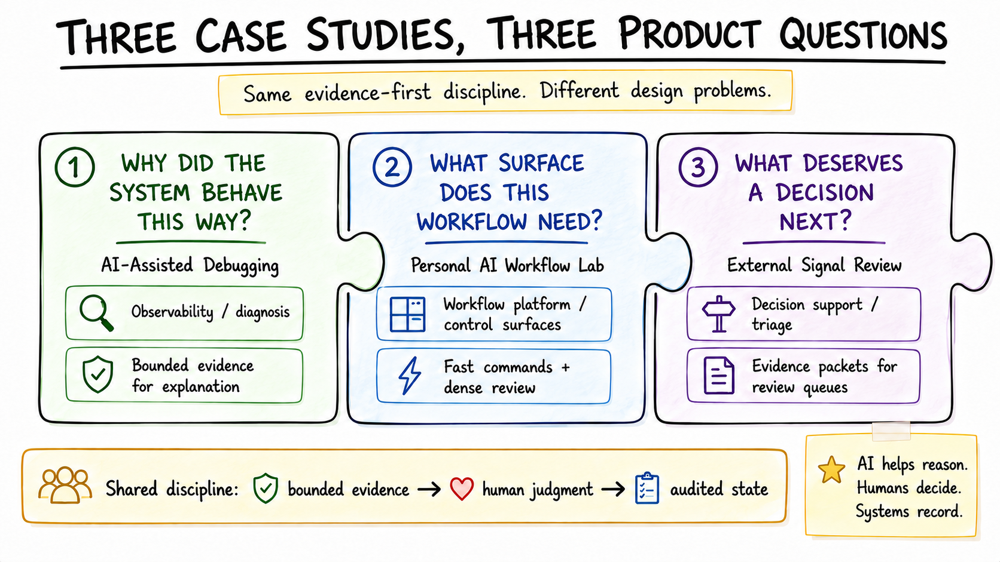

# Technical Case Studies

This repository contains sanitized technical case studies and selected reference artifacts from private AI, observability, and agent orchestration work.

The material here is public-facing, selective, and privacy-reviewed. Private source repositories, operational configuration, real logs, personal data, and environment-specific details are intentionally excluded.

Start with the case study that matches your review goal: observability/debugging, AI workflow orchestration, or decision support for external signal review.

## Quick Read For Busy Reviewers

- These case studies show how I design AI-assisted systems around bounded evidence, human judgment, and auditable state changes.
- The series covers three distinct problems: explaining system behavior, designing workflow control surfaces, and preserving decision quality in triage.
- The artifacts are public-safe and synthetic where needed; they demonstrate product and systems thinking, not a supported product.

## Series Thesis

These case studies explore one product pattern across different layers: AI is most useful in complex workflows when it reasons over bounded evidence, humans own decisions, and runtime systems record state changes explicitly.

The shared terms are intentional. Each case study uses evidence packets, AI assessment, human review, and audit trails in a different lane.

| Case study | Lane | Status | What it proves |
|---|---|---|---|
| [Building an AI-Assisted Debugging Layer for Complex Automation](case-studies/ai-observability-home-automation/README.md) | Observability / diagnosis | Published | Complex system behavior can be explained from bounded evidence without letting AI actuate. |
| [Personal AI Workflow Lab](case-studies/personal-ai-workflow-lab/README.md) | Workflow platform / control surfaces | Published | Multiple bounded AI-assisted workflows can be operated through fast command surfaces and dense review surfaces. |
| [External Signal Review Workflow](case-studies/external-signal-review-workflow/README.md) | Product decision support / triage | Published | Noisy external inputs can become structured evidence packets, AI assessment, human decisions, and audited state updates. |

## How The Three Case Studies Fit Together

## What This Repository Contains

- Public-safe technical narratives.
- Architecture and workflow explanations.
- Sanitized diagrams.
- Synthetic examples that show the shape of the work without exposing private systems.

## What This Repository Is Not

- A supported product.
- A source-code mirror of private systems.
- A deployment guide.
- A place for unsanitized operational artifacts, private identifiers, or environment-specific configuration.

## Case Studies

- [Building an AI-Assisted Debugging Layer for Complex Automation](case-studies/ai-observability-home-automation/README.md): a case study about bounded evidence, observability, non-actuating AI, and human review in a complex event-driven automation system.

- [Personal AI Workflow Lab](case-studies/personal-ai-workflow-lab/README.md) — Telegram-first AI workflow lab showing bounded evidence packets, fast command surfaces, dense review surfaces, human-owned decisions, and sanitized implementation evidence.

- [External Signal Review Workflow](case-studies/external-signal-review-workflow/README.md): product decision support workflow showing external signal intake, bounded evidence packets, AI assessment, human triage, and audited state updates.
