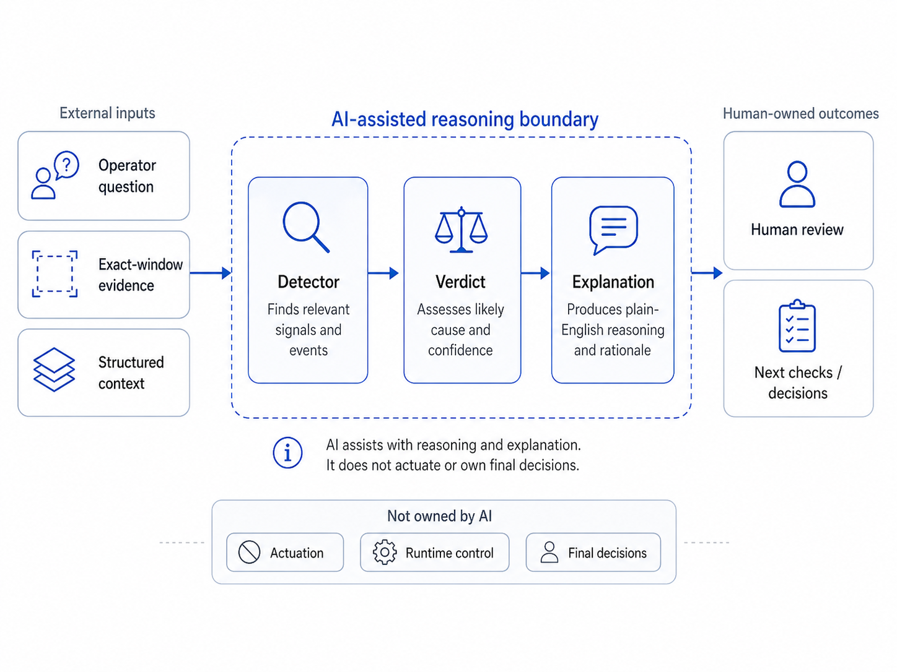
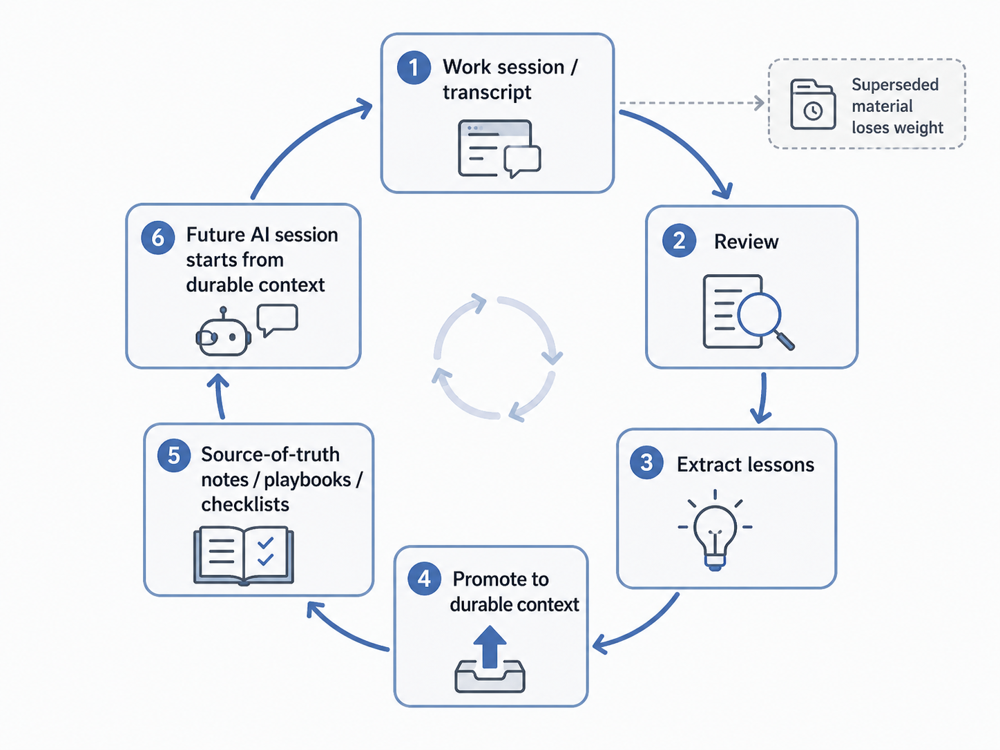
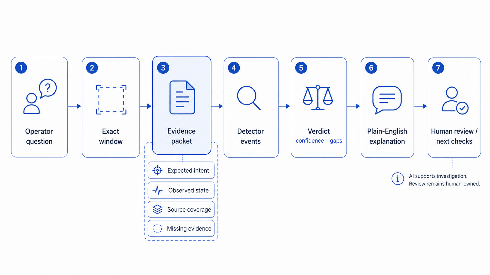
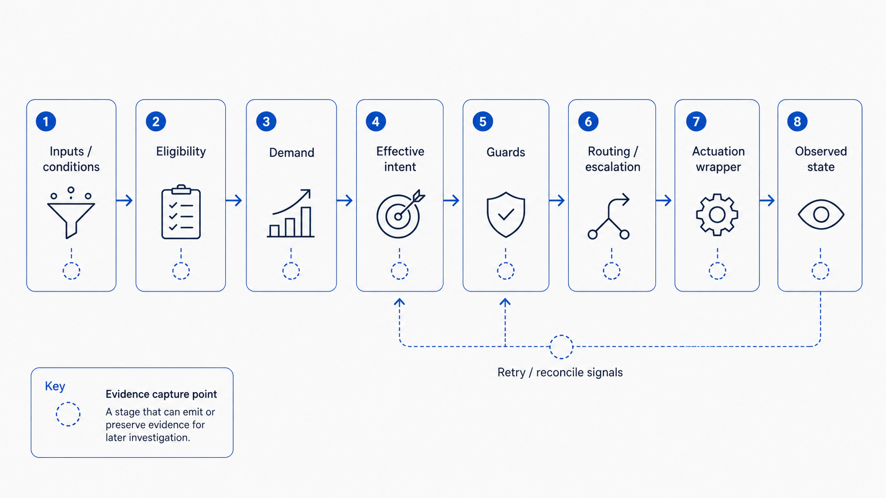
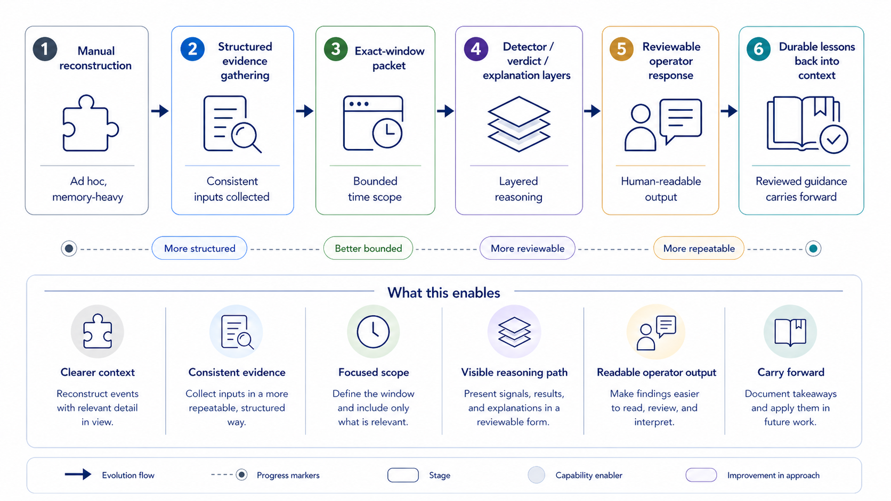

# Building an AI-Assisted Debugging Layer for Complex Automation

Using bounded evidence, curated context, and non-actuating AI to explain why a system behaved the way it did.

[Case-study home](README.md) | [System context](SYSTEM_CONTEXT.md) | [How I AI](AI_ASSISTED_WORKFLOW.md) | [Canonical context](CANONICAL_CONTEXT_MODEL.md) | [Synthetic scenario](synthetic-examples/exact-window-scenario.md) | [Artifact index](PUBLIC_ARTIFACT_INDEX.md)

## Start here

This page is written as a public technical case study. I keep private operational details out of it, but the technical pattern is real.

## The short version (TL;DR)

I built an observability and explanation layer around a complex event-driven automation system where current state alone was not enough to explain behavior. The useful question became: during this exact window, what did the system appear to intend, what actually happened, what evidence supports that explanation, and what should I review before deciding what to do next?

## Why I built this

The system had become too complex to debug from current state alone.

In a simple system, current state might be enough. In a layered automation system, the same state can mean several different things: expected behavior, a stale signal, an external input, a guard decision, a retry or reconcile path, a missed record, or a real mismatch between intent and outcome. The [system context](SYSTEM_CONTEXT.md) page explains that underlying automation/control ambiguity at a safe level.

Before this pattern, investigation depended on manually reconstructing intent, observed state, guard behavior, and missing evidence from separate sources. The exact-window packet makes that reconstruction explicit: each source is listed, coverage is visible, and the explanation can point to both evidence and gaps.

I wanted a repeatable way to answer: given a specific question and a specific time window, what did the system expect, what actually happened, what evidence exists, what is missing, and how confident should an operator be?

The domain matters here. It creates real ambiguity, operational constraints, feedback loops, and safety boundaries. The case study is public-safe, but the shape of the problem comes from a real, multi-layered personal automation system with production-style operating constraints.

## The idea

The core shift was from broad reconstruction to bounded investigation.

Instead of starting with all available history, the workflow starts with an exact-window question. The system gathers only the evidence needed for that interval, shapes it into a packet, identifies relevant signals, classifies the likely cause, and then generates a plain-English explanation.

Plain-English terms:

- **Exact-window**: a specific start and end time for the investigation, not an open-ended search.
- **Evidence packet**: a structured bundle of facts for that window, including expected intent, observed state, source coverage, warnings, and gaps.
- **Expected-vs-actual**: comparing what the system appeared to intend with what was observed.
- **Detector event**: a normalized signal such as "expected intent stayed the same, but observed state changed."
- **Verdict**: a bounded interpretation of the detector events, including confidence, severity, and next checks.
- **Pipeline health**: whether the investigation machinery had enough complete evidence to trust the result. This is separate from whether a domain issue exists.
- **Sanitized / synthetic example**: content rewritten or invented to remove private details while preserving the technical pattern.
- **Canonical context / machine-first context**: maintained docs, contracts, playbooks, and references that future AI-assisted work can read without relying on raw chat history.

For example, a packet can be `degraded_but_usable` when observed-state evidence is complete but guard coverage is partial. That does not mean the domain issue is low severity; it means the investigation can produce a useful explanation only if it also shows the missing guard evidence and lowers confidence accordingly.

## How the observability layer works

The investigation path is intentionally layered:

Debugging-layer architecture: the underlying automation system produces events and evidence, which are shaped into bounded packets before AI-assisted reasoning, explanation, and human review.

The diagram shows the debugging layer, not the full automation/control system; the underlying system is represented only as the source of events and evidence.

In the diagram, the **event-driven automation system** produces signals for the **observability / evidence layer**. The **evidence packet builder** narrows those signals into a bounded packet. The **detector layer**, **verdict layer**, and **explanation layer** turn that packet into reviewable reasoning, while **pipeline health** tracks evidence completeness and **human / operator review** remains outside the **AI-assisted reasoning boundary**.

1. I ask a bounded question, for example why a state changed during a specific window.
2. The question is resolved to an exact time window.
3. The system creates an evidence packet for that window.
4. Detector events mark important patterns in the packet.
5. A verdict layer classifies likely cause, confidence, severity, and next checks.
6. An explanation layer turns the verdict facts into readable reasoning.
7. Pipeline health reports whether the evidence collection was complete, partial, or failed.
8. I can review the response, evidence, gaps, confidence, and boundaries before deciding what to do next.

The important design choice is that each layer has one job. Evidence is not the explanation. Detector events are not the final answer. A verdict is not a command. Pipeline health is not the same thing as issue severity.

That separation makes the output reviewable. If the final explanation is weak, a reviewer can inspect whether the packet was incomplete, the detector signal was thin, the verdict overreached, or the evidence simply does not support a stronger answer.

Qualitatively, the workflow evolved in stages. Early investigation depended on manual multi-source evidence collection and careful context packaging. Over time, more of the work moved toward prompt-driven bounded packet generation, packet analysis, and fix planning. That does not mean the system became autonomous. It means the investigation inputs became structured enough that AI could help reason over them without owning the decision.

## Where AI fits — and where it does not

AI fits in the reasoning and explanation path.

It can read a bounded packet, summarize likely causes, identify missing evidence, explain confidence, and produce an operator-readable response. It is useful because the packet gives it structure and limits. The AI is not guessing from raw history; it is working from a curated slice of evidence.

AI boundary: the assistant supports reasoning and explanation, but does not actuate controls or own final decisions.

In the diagram, bounded inputs flow into the AI-assisted reasoning area, while actuation, source authority, and final decisions remain outside that boundary.

In the version described here, AI is limited to investigation, reasoning, and explanation. It does not actuate controls, mutate controller state, bypass guards, or become the source of authority. Any future move toward action-taking would require a separate design, approval, safety boundary, and validation model. The human/operator remains the decision-maker.

That boundary is the point. The system uses AI to make investigation easier to understand, not to hand over operational control.

The broader workflow is described in [How I AI](AI_ASSISTED_WORKFLOW.md). In short: I own goals, domain judgment, validation, and acceptance. ChatGPT helps reason and synthesize. Codex applies scoped repo changes and runs bounded checks.

## How the system keeps context

The AI layer is only useful if its context is trustworthy.

Raw chat history is useful, but it is not the source of truth by default. Chats can contain partial decisions, outdated assumptions, wrong turns, and missing validation.

There is also a practical model limitation. Current AI models have limited working context. Long transcripts and raw history can exceed useful context windows, increase token cost, and mix current decisions with stale or superseded assumptions.

Older transcripts may become less relevant as the system evolves, especially when they are superseded by newer validated decisions. Newer validated source-of-truth docs, playbooks, contracts, checklists, and canonical references should carry more weight because they capture what survived review and what is still current.

Transcripts can still be useful as historical evidence, especially when I need to understand why a decision was made. But I use them based on freshness, validation, and whether the lesson was promoted into durable context. The [canonical context model](CANONICAL_CONTEXT_MODEL.md) explains this pattern in more detail.

The workflow keeps transcripts and durable notes available outside the active prompt, then selectively brings in relevant reviewed context when building an investigation packet or starting a new AI-assisted work session.

That creates machine-first context: context written so both humans and future AI-assisted work can use it reliably. It says what is known, what is still uncertain, what boundaries matter, and which claims are safe to repeat.

This matters because AI-assisted engineering can drift if each session starts from loose memory. Curated context gives the next investigation a stable place to stand.

Context retention loop: raw sessions inform durable guidance, while superseded material loses weight.

> In this case study, **state-of-truth** means the curated notes and references that capture what is currently trusted, what changed, and how future AI-assisted work should interpret the system. It is not raw chat history.

The system context behind this debugging layer is described in [The Automation System Behind the Debugging Layer](SYSTEM_CONTEXT.md). That page stays high level: it explains the automation/control shape without exposing internal infrastructure, devices, paths, access details, or operational records.

## A public-safe composite walkthrough

The public example is a public-safe composite example. It is rewritten to remove private details while preserving the technical pattern. It is not copied from private runtime data, logs, source records, transcripts, or operational systems. The full scenario starts in the [exact-window synthetic scenario](synthetic-examples/exact-window-scenario.md), and the resulting explanation is shown in the [operator response](synthetic-examples/operator-response.md).

Scenario: an operator asks why a primary actuator became `active` during a defined time window when expected intent appeared to remain `hold`.

The investigation packet captures:

Debugging-layer flow: an operator question is narrowed into an exact evidence window before explanation.

- The exact window requested by the operator.
- Expected intent for that window.
- Observed actuator state before, during, and after the transition.
- Detector events, including an expected-vs-observed mismatch.
- A verdict with medium confidence.
- Evidence gaps, including incomplete guard coverage near the transition.
- Pipeline health marked as `degraded_but_usable`.

The AI does not receive unlimited raw history. It receives a bounded, sanitized evidence packet containing the operator question, exact time window, evidence-source coverage, expected intent, observed state, detector events, confidence, evidence gaps, and next-check candidates. The current public sample is synthetic: [Synthetic evidence packet](synthetic-examples/evidence-packet-shape.json). A real runtime packet could be published later only after separate privacy and security review.

The AI explanation then says, in plain language: expected intent stayed at `hold`, observed state changed to `active`, an external input may explain the divergence, but incomplete guard evidence prevents a stronger conclusion.

No action is taken automatically. The response gives the operator a reviewable explanation and recommended next checks.

The operator-facing output is a review aid, not an approval screen or automated action. It gives a short answer, evidence used, confidence, gaps, and recommended next checks. From there, the operator can inspect another source, rerun the packet with fuller evidence, or decide on any action outside the AI workflow.

Automation/control model: evidence capture across stages helps explain the decision path, not only the final observed state.

In this model, **inputs / conditions** move through **eligibility**, **demand**, **effective intent**, **guards**, **routing / escalation**, and an **actuation wrapper** before becoming **observed state**. Evidence capture points make each stage reviewable, including retry or reconcile signals.

Investigation evolution: the workflow moved from ad hoc reconstruction toward bounded evidence, layered reasoning, reviewable output, and durable lessons carried forward.

## Choices that mattered

- I kept the investigation bounded to an exact window so the system would not drift into broad history search.
- I separated expected intent from observed state because current state alone can be misleading.
- I used detector events as signals, not final answers.
- I kept verdicts explicit about confidence and gaps.
- I treated pipeline health as its own output so "the pipeline could not fully evaluate" is not confused with "nothing happened."
- I kept AI on the explanation side, away from actuation.
- I used synthetic examples for public communication instead of redacted private data.
- I kept durable context in maintained references rather than treating raw chat history as the source of truth.

## What this shows

This is the kind of work I wanted the case study to show: taking a messy, real-world system, separating the problem into layers, creating better evidence, and using AI where it adds leverage without giving it authority.

In practical terms, that means:

- Designing an investigation workflow for complex event-driven behavior.
- Turning ambiguous behavior into bounded, reviewable evidence.
- Using AI as a reasoning partner without giving it control authority.
- Building public-safe examples that communicate the pattern without exposing private systems.
- Keeping future AI-assisted work grounded with curated, machine-readable context.

The domain matters because it creates real ambiguity and feedback loops. What this shows is how a messy real-world system can be made easier to investigate through boundaries, evidence contracts, curated context, and AI-assisted reasoning.

## A quick note on boundaries

The value here is the architecture, reasoning workflow, and operating model, not audited performance claims.

I cannot publish raw system details, private logs, audited metrics, or source code here.

I am also not claiming autonomous actuation. The AI explains evidence; it does not operate the system.

The value shown here is the architecture, the reasoning workflow, and how investigation became more structured and repeatable over time. Any quantified impact, reliability, or production-completeness claim would need separate validation.

## Public-safe examples

Start with these examples:

- [Exact-window scenario](synthetic-examples/exact-window-scenario.md): the operator question and investigation setup.
- [Operator response](synthetic-examples/operator-response.md): the reviewable answer produced from the synthetic packet.
- [CLI examples](synthetic-examples/cli-examples.md): illustrative command shapes and outputs.
- [Synthetic evidence packet](synthetic-examples/evidence-packet-shape.json): a public-safe bounded packet shape, not a real runtime export or proof of production completeness.

I cannot publish raw operational records, but I can show the shape of the workflow.

The examples are public-safe composites: realistic enough to show how the investigation works, rewritten so they do not expose private system details.

## If you want to go deeper

These pages extend the main story without exposing private details:

- [System context](SYSTEM_CONTEXT.md): the automation/control architecture behind the debugging layer.
- [How I AI](AI_ASSISTED_WORKFLOW.md): the ChatGPT/Codex workflow, human ownership, and context-retention loop.
- [Canonical context model](CANONICAL_CONTEXT_MODEL.md): how durable context replaces loose transcript memory over time.
- [Exact-window scenario](synthetic-examples/exact-window-scenario.md): the public-safe composite walkthrough.
- [Operator response](synthetic-examples/operator-response.md): the explanation a human could review.
- [CLI examples](synthetic-examples/cli-examples.md): illustrative command shapes for the workflow.
- [Artifact index](PUBLIC_ARTIFACT_INDEX.md): a simple map of the public-safe pages, diagrams, examples, and packet sample.

Next: [Exact-window synthetic scenario](synthetic-examples/exact-window-scenario.md)
