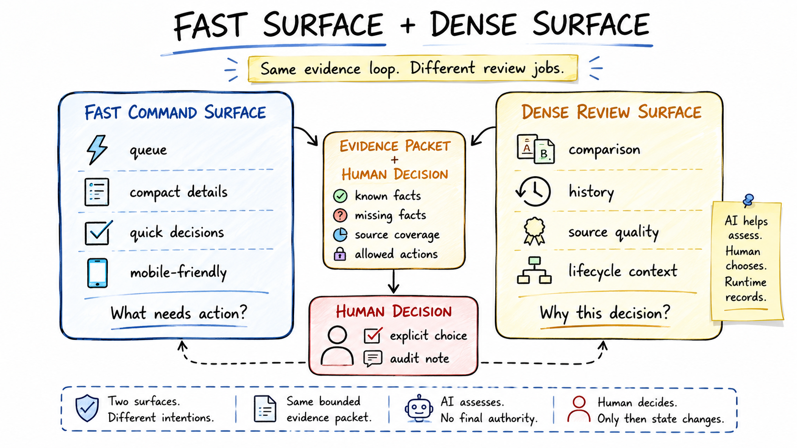

# Control Surfaces

The workflow uses two primary review surfaces: a fast command surface and a dense review surface. They exist because review density changes by moment.

## Fast Command Surface

The fast command surface is for quick status, queues, compact item details, AI assessment requests, and lightweight decisions.

It is optimized for questions like:

- What needs review?
- What are the top items needing a decision?
- What does `ITEM-123` look like?
- What did AI assess from the packet?
- Do I want to approve, park, close, or clarify this item?

This surface should stay concise. If the response needs long history, comparison tables, or source-quality inspection, the workflow should route the user to a denser view.

## Dense Review Surface

The dense review surface is for comparison, history, ranking, source quality, and richer context.

It is useful when:

- Several items are close enough that ranking needs inspection.
- Source coverage differs across items.
- Prior decisions or related signals matter.
- The user needs to compare risks, missing facts, or next actions.
- A decision should be prepared with more context on screen.

The dense surface is not a replacement for commands. It is the place for slower judgment.

## Helper / Browser Layer

Some evidence work is risky or brittle to fully automate. The helper layer prepares evidence, checks source coverage, detects missing facts, and creates reconciliation plans. It can also support manual or browser-assisted collection when full automation would overreach.

The helper layer should not decide. Its job is to make the packet more honest.

## Why Both Surfaces Exist

A single chat-like surface is fast but weak for dense comparison. A dashboard-only workflow is reviewable but too heavy for quick triage. A backend-only workflow can process data but hides judgment. The split keeps each surface honest:

- command surface for movement;
- dense review surface for inspection;
- helper layer for evidence preparation;
- runtime for state and audit;
- human for final decision.

| Feature | Fast Command Surface | Dense Review Surface |
|---|---|---|
| Primary goal | Triage and movement | Deep judgment |
| User intent | "What's next?" | "Why this over that?" |
| Data density | Low / bounded facts | High / history and comparisons |
| Best fit | Queues, compact details, quick decisions | Ranking, source quality, lifecycle review |

## Alternatives Considered

| Alternative | Why it was not enough |
|---|---|
| Generic chat only | It still required manual context gathering and made state transitions hard to audit. |
| Dashboard only | It handled dense review but made quick mobile triage too heavy. |
| Fully autonomous processing | It would blur assessment, decision, and action in a workflow where ambiguity matters. |
| Backend-only automation | It could reconcile data but would not provide a useful decision surface for human judgment. |

## Product Judgment

The command surface was a product choice: fast control for bounded actions. The dense surface was also a product choice: richer context when decisions require comparison. The helper layer exists because evidence quality is part of the user experience, not an implementation detail.
