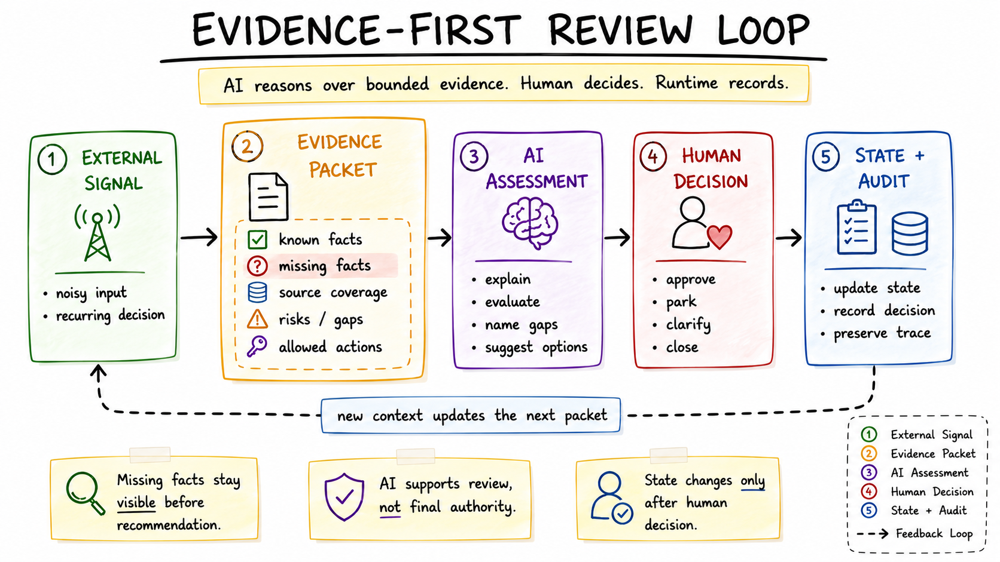

# External Signal Review Workflow: Evidence-First AI Decision Support

I built this workflow to turn scattered external signals into bounded evidence, constrained AI assessment, and explicit human decisions.

## Executive Summary

- **Problem:** Noisy external signals were easy to collect but hard to evaluate consistently.
- **Solution:** I designed an evidence-first review loop with a fast command surface, a dense review surface, helper evidence layers, bounded packets, AI assessment, human decisions, and audited state updates.
- **What this demonstrates:** Product judgment around AI-assisted decision support, public-safe evidence design, human-in-the-loop state mutation, and practical surface design for repeated review workflows.

## Where This Fits In The Series

This is the product decision-support and triage layer of the series. It applies the shared pattern to noisy external inputs: turn scattered signals into bounded evidence packets, ask AI for constrained assessment, preserve missing facts and ambiguity, and update state only after a human decision.

The repeated terms are deliberate. Evidence packets, AI assessment, human decisions, and audit trails are the series thesis applied to a decision queue rather than to system diagnosis or workflow control surfaces.



## The Problem I Was Solving

I had a recurring problem: external signals kept arriving from multiple places -- inbound opportunities, vendor notices, monitored topics, or any other recurring decision queue -- and each signal needed a decision. Some were clearly irrelevant. Some were promising. Some were impossible to evaluate until I filled in missing facts.

The real cost was not reading one item. It was repeating the whole review loop: find the source, extract the relevant facts, remember prior context, notice what was missing, decide whether the item deserved attention, and then update the workflow without losing the reasoning trail.

I wanted fast triage without turning every decision into a long desktop review session. I also wanted deeper comparison when the quick view was not enough. Most importantly, I wanted AI help without giving AI final authority over the outcome.

## Why Normal AI Assistance Was Not Enough

Normal AI assistance helped once I manually gathered context. That still left the slowest part with me: assembling the packet, checking source coverage, spotting ambiguity, and deciding whether the AI had enough evidence to reason responsibly.

The product problem became concrete: how do I turn noisy incoming signals into bounded evidence packets, ask AI for an assessment, keep ambiguous cases in clarification, and mutate state only after I decide?

## Quick Example / One Review Loop

A compact review loop looks like this:

```text
I run /review
The queue shows ITEM-123 as needing a decision
I inspect /details ITEM-123
The packet shows known facts, missing facts, source coverage, and ambiguity flags
I request /evaluate ITEM-123
AI recommends "park until missing facts are resolved" with medium confidence
I choose /park ITEM-123
The runtime saves the state update and audit note
```

The important part is the handoff discipline. AI receives a bounded packet. Missing facts stay visible. Ambiguous evidence does not mutate lifecycle state. The runtime changes state only after I choose an allowed action.

## The Workflow I Built

The workflow separates seven jobs:

- **Noisy input:** external signals arrive from multiple source categories.
- **Helper/evidence layer:** source snippets, stored state, prior context, and reconciliation hints are gathered.
- **Bounded evidence packet:** known facts, missing facts, coverage, risks, and allowed actions are shaped into a review contract.
- **AI reasoning:** AI assesses the packet, names risks, and recommends a next human action.
- **Fast command surface:** quick queues, details, evaluations, and lightweight decisions.
- **Dense review surface:** comparison, ranking, history, richer context, and source-quality review.
- **Audited runtime/state update:** explicit human decisions become recorded state transitions.

The core idea is evidence before recommendation, recommendation before decision, and decision before mutation.

## The Evidence-First Review Loop

The review loop is:

```text
noisy input
-> fact extraction
-> missing facts
-> evidence packet
-> AI assessment
-> ranked review queue
-> compact details
-> human decision
-> stored state/audit
```

This made workflow gaps inspectable before state changes. Instead of asking AI to infer from a vague prompt, I could inspect the packet and see whether the recommendation was supported.

## Fast Command Surface Vs Dense Review Surface

The fast command surface exists for quick status, queues, compact details, and lightweight decisions. It is useful when the question is narrow: what needs review, what does this item look like, what did the assessment say, and what action do I want to take?

The dense review surface exists for comparison, history, ranking, source quality, and richer context. It is useful when several items are close, when source coverage is uneven, or when a decision requires slower inspection.

That split was product judgment, not convenience. A chat-like control surface is good for quick movement. A dense review surface is better for sustained comparison. Forcing both jobs into one interface made the workflow either too shallow or too heavy.

## Where AI Helped And Where It Stopped

AI helped with synthesis: summarizing known facts, comparing evidence, naming gaps, assessing risks, and recommending a next human action.

AI stopped at authority. It did not approve, close, contact anyone, submit anything, or turn its own recommendation into workflow state. The runtime accepted only explicit allowed actions that I chose.

See [AI_RUNTIME_HUMAN_BOUNDARY.md](AI_RUNTIME_HUMAN_BOUNDARY.md) for the full boundary and Decision and State Mutation Protocol.

## Ambiguity And Reconciliation Semantics

The workflow treats ambiguity as a first-class state, not an inconvenience. If a signal appears related to an existing item, conflicts with stored facts, lacks key evidence, or could map to more than one record, the system keeps it in clarification instead of treating the best guess as truth.

Reconciliation plans are also separate from applied actions. A dry-run plan can say what would be created, updated, ignored, or sent to manual review. That plan is evidence. It is not the same thing as completed mutation.

## Concrete proof artifacts

The main proof artifacts in this private draft are:

- [SYNTHETIC_PACKET.md](SYNTHETIC_PACKET.md): a synthetic/public-safe Markdown evidence packet.
- [synthetic-examples/signal_packet.synthetic.json](synthetic-examples/signal_packet.synthetic.json): a compact JSON-like packet shape.
- [AI_RUNTIME_HUMAN_BOUNDARY.md](AI_RUNTIME_HUMAN_BOUNDARY.md): AI/runtime/human responsibilities and the mutation protocol.
- [IMPLEMENTATION_ACTIVITY_LEDGER.md](IMPLEMENTATION_ACTIVITY_LEDGER.md): a sanitized qualitative implementation ledger.

## Public-Safe Synthetic Example

The synthetic example uses `ITEM-123`, a generic external signal with partial source coverage. The packet shows known facts, missing facts, ambiguity flags, risk checks, an AI assessment request, allowed decisions, mutation preview, and audit fields.

The companion assessment recommends parking the item until a missing fact is resolved. It also states that there are no runtime state changes until human decision.

## Implementation Evidence And Activity Ledger

The implementation evidence is summarized qualitatively in [IMPLEMENTATION_EVIDENCE.md](IMPLEMENTATION_EVIDENCE.md). The activity ledger is intentionally sanitized and milestone-based rather than a raw change log. It shows the evolution from ingestion and packet generation to review queues, ambiguity handling, reconciliation separation, and surface split.

Direct ledger: [IMPLEMENTATION_ACTIVITY_LEDGER.md](IMPLEMENTATION_ACTIVITY_LEDGER.md).

## Tradeoffs

This design adds structure. It takes more work than sending a single prompt to AI, and it requires discipline around packet shape, allowed actions, and state transitions.

The payoff is that the workflow becomes easier to challenge. I can see what was known, what was missing, what AI inferred, what I decided, and what the runtime changed. That is more valuable to me than a faster but opaque answer.

## What I Learned

The most useful AI workflow pattern was not autonomy. It was structured decision support.

Evidence packets made missing facts explicit before recommendation. The command surface gave me fast mobile triage without forcing dense review into chat. The dense review surface preserved comparison and richer context. The mutation protocol preserved human ownership of final decisions.

The general lesson is that AI decision support becomes more useful and safer when it starts from structured evidence.

## Related Case Studies

Links will be added after public export review. Titles are working names and may change.

**Published / available in this series**

- AI-Assisted Debugging Layer for Complex Automation.
- Telegram-First Control Surface for a Personal AI Workflow Lab.

**Forthcoming / planned**

- Control workflow review and bounded runtime operations.
- Additional verticals in the Personal AI Workflow Lab series after separate public-safe review.

## Artifact Index

- [WORKFLOW_MODEL.md](WORKFLOW_MODEL.md): end-to-end workflow model.
- [CONTROL_SURFACES.md](CONTROL_SURFACES.md): fast command surface, dense review surface, helper layer, and alternatives.
- [AI_RUNTIME_HUMAN_BOUNDARY.md](AI_RUNTIME_HUMAN_BOUNDARY.md): responsibility model and Decision and State Mutation Protocol.
- [SYNTHETIC_PACKET.md](SYNTHETIC_PACKET.md): synthetic/public-safe evidence packet.
- [SYNTHETIC_EVALUATION.md](SYNTHETIC_EVALUATION.md): synthetic AI assessment.
- [IMPLEMENTATION_EVIDENCE.md](IMPLEMENTATION_EVIDENCE.md): qualitative implementation evidence.
- [IMPLEMENTATION_ACTIVITY_LEDGER.md](IMPLEMENTATION_ACTIVITY_LEDGER.md): sanitized activity ledger.
- [PUBLIC_ARTIFACT_INDEX.md](PUBLIC_ARTIFACT_INDEX.md): full artifact map.
