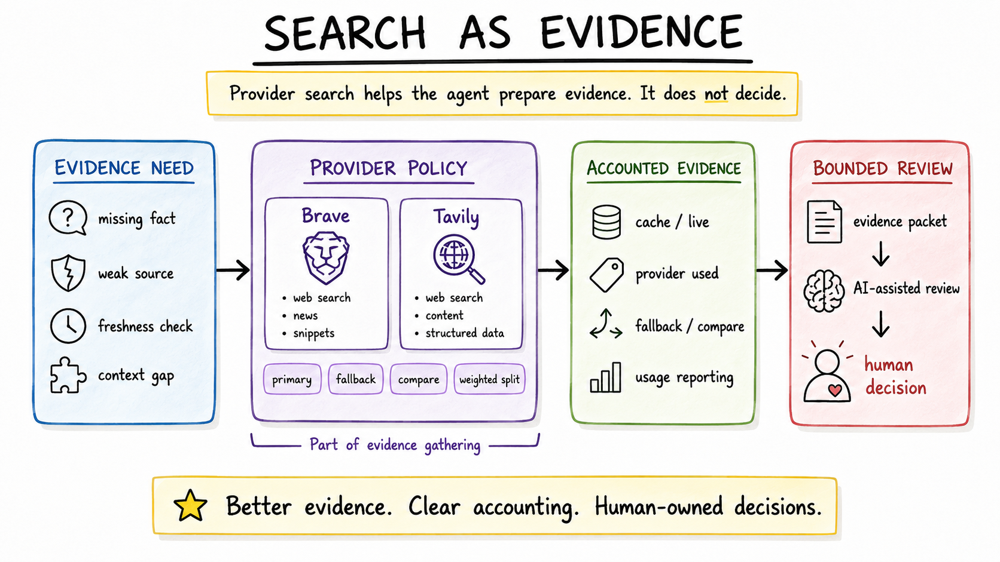

# Search Provider Strategy: Evidence Robustness and Resource-Aware Retrieval

Search became useful in this workflow when it was treated as controlled evidence gathering, not as evaluation. The agent can ask for targeted external context, but the result still has to move through evidence gap checks, packet construction, AI-assisted reasoning, validation, and human decision.

This page describes the public-safe architecture pattern behind that choice: Brave and Tavily as peer providers behind a configurable provider-policy layer, with cache reuse, usage accounting, source attribution, and auditability before AI-assisted review.

## Why Search Became Part Of The External Signal Workflow

The External Signal Review Workflow starts with noisy incoming items. Some arrive with enough context to review immediately. Others need a small amount of supporting evidence before they can be evaluated responsibly.

Search helps with that second case. It can gather public source references, fill narrow evidence gaps, and clarify whether a packet has enough source coverage for an AI-assisted assessment. It is one tool in the evidence layer, alongside stored state, prior decisions, reconciliation checks, manual context, and synthetic/public-safe packet construction.

The important design choice was to keep search bounded. A search request should have a reason: a missing fact, a weak source, a need to compare public context, or a packet-quality concern. It should not become a broad background crawl or a substitute for judgment.

## Retrieval Is Not Evaluation

Retrieval answers a narrow question: what evidence can be gathered for this review?

Evaluation answers a different question: what should the packet imply, given its evidence, gaps, risks, and allowed actions?

Those jobs stay separate:

- **Evidence gathering:** collect public source references and note coverage.
- **Packet construction:** normalize facts, missing facts, source attribution, and review scope.
- **AI-assisted reasoning:** synthesize only over the bounded packet.
- **Validation and audit:** inspect whether the packet supports the recommendation.
- **Human decision:** choose the next workflow state.

That separation prevents search results from becoming hidden authority. A provider can return useful material, weak material, conflicting material, or no material. The workflow should record that difference before any recommendation is considered.

## Brave And Tavily As Peer Providers

Brave and Tavily were introduced as peer providers behind a configurable provider-policy layer.

The rollout started conservatively so provider behavior, accounting, cache reuse, and packet impact could be validated before broader use. That was a safety, resource, and validation practice, not a provider hierarchy. Tavily is not treated as secondary, and Brave is not treated as superior by default.

The provider-policy layer keeps the workflow from hard-coding provider assumptions into evaluation logic. It lets the agent route searches according to the current policy while preserving the same downstream packet contract: source references, evidence notes, cache status, provider use, and audit fields.

## Provider-Policy Configuration

The policy layer supports routing modes that fit different review needs:

| Mode | Purpose |
|---|---|
| `primary provider` | Use the configured provider for ordinary targeted searches. |
| `fallback on weak evidence` | Try another provider when the first result set is missing, thin, conflicted, or unusable for the packet. |
| `compare` | Query peer providers when the review needs provider comparison or stronger confidence in source coverage. |
| `weighted split` | Route a controlled share of searches to each provider to observe behavior and manage resource use over time. |

These modes allow gradual rollout, provider comparison, resource conservation, and policy-driven routing without calling every provider for every search.

The key product constraint is that routing policy should be inspectable. If a packet includes evidence from search, the review surface should make it possible to see why search ran, which provider was used, whether fallback or comparison was triggered, and what source material was actually carried forward.

## Usage Accounting And Reporting

Usage accounting matters because retrieval has cost, latency, reliability, and audit implications. It is not enough to know that the packet contains sources. The workflow also needs to know how the evidence was acquired.

The provider layer records which provider was used, whether evidence came from cache or live search, and whether fallback or comparison behavior was triggered. Reporting should make these categories inspectable:

- live provider calls versus cache hits
- skipped searches because the packet already had enough evidence
- fallback or compare behavior
- provider errors, quota limits, or configuration gaps
- estimated usage or cost where applicable, without publishing private numbers
- packet impact, such as whether retrieved evidence resolved a gap or remained too weak

This reporting is part of resource-aware evidence acquisition. It helps tune provider policy, reduce repeated work through cache reuse, notice weak retrieval patterns, and keep external evidence gathering visible during audit.

## Other Providers Considered

Other provider categories were left open for later implementation rather than presented as fully evaluated:

| Category | Why It Remained Later-Stage |
|---|---|
| Google/Bing-style search APIs | Cost, quota, policy, and result-shape differences would need separate normalization and accounting work. |
| Direct ATS/company-careers integrations | Integrations are fragmented and often useful only for narrower structured-role retrieval. |
| Job-board APIs | These can provide structured role data, but they are narrower than general evidence gathering and introduce provider-specific constraints. |
| Manual/browser-assisted context | Useful when automation would be brittle or inappropriate, but it should remain explicit human-controlled enrichment rather than hidden scraping. |

The first goal was to prove provider-policy, accounting, and source-grounded packets, not to maximize provider count.

## Diagram / Architecture

The provider-policy layer keeps retrieval separate from evaluation: search gathers attributed evidence, accounting records usage, the packet constrains reasoning, and the human decision remains final.

## Tradeoffs

The provider-policy layer adds structure. It requires routing configuration, cache behavior, usage reporting, error handling, and review-surface visibility. For a one-off lookup, that can feel heavier than a direct search.

The payoff is that retrieval becomes challengeable. I can inspect whether a packet used cached evidence, called a provider live, skipped search, triggered fallback, compared providers, or failed because of quota or configuration. That makes the downstream AI assessment easier to validate.

The other tradeoff is restraint. The workflow should not call every provider by default just to look comprehensive. Better retrieval means enough relevant evidence with clear provenance and accounting, not maximum provider activity.

## What Changed

Adding provider policy changed the evidence layer in a few practical ways:

- Search became an explicit retrieval capability, not an assumed background behavior.
- Provider routing became configurable instead of embedded in evaluation logic.
- Brave and Tavily could be compared as peer providers without changing packet shape.
- Cache hits, live calls, skipped searches, fallback, and compare behavior became reportable review facts.
- Evidence packets could carry source attribution and retrieval context before AI-assisted reasoning.

The result is more disciplined evidence gathering. The AI review still receives a bounded packet, and the human decision remains the final authority.

## Next Iteration

The next iteration is stronger reporting around provider behavior and packet impact:

- make provider-use summaries easier to inspect across review sessions
- track when retrieval resolves a named evidence gap versus when it stays inconclusive
- tune fallback and compare policy from observed packet quality
- keep manual/browser-assisted enrichment explicit where automated retrieval is brittle
- preserve public-safe diagrams and synthetic examples without exposing private records

The goal remains resource-aware evidence acquisition: gather enough attributed evidence to support review, account for provider use, and keep evaluation and decision authority separate.
