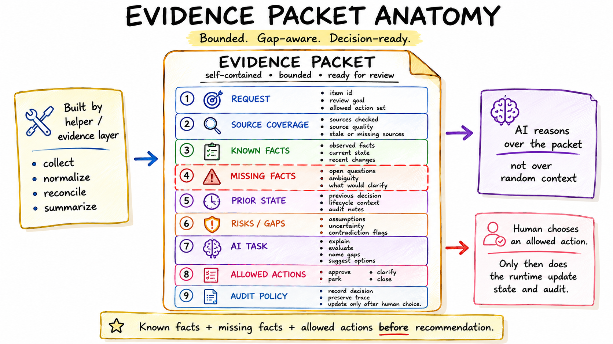

# Synthetic/Public-Safe Evidence Packet

This is a synthetic/public-safe composite. It is not a real record and does not contain real source values, contacts, URLs, private identifiers, or raw evidence.



## Packet Header

| Field | Value |
|---|---|
| Signal ID | `ITEM-123` |
| Packet type | External signal review |
| Workflow state | Needs decision |
| Decision state | Not decided |
| Packet purpose | Request AI assessment from bounded evidence |
| Source coverage | Partial |
| Prior history status | Checked, no blocking prior decision found |
| Duplicate or repost hint | Possible related signal, not confirmed duplicate |

## Extracted Facts

| Fact category | Known fact | Evidence status |
|---|---|---|
| Signal summary | A potentially relevant external item arrived from a noisy notification source. | Present in source summary. |
| Domain | The item appears related to a target area currently being monitored. | Supported by source text. |
| Scope | The item may require deeper review before action. | Inferred from partial detail. |
| Location / context | The signal appears viable at a high level, but the practical constraint is not fully confirmed. | Partial. |
| Seniority / level | The signal suggests an appropriate level, but source wording is not conclusive. | Partial. |
| Prior interaction | No blocking prior decision is visible in the available workflow state. | Checked in stored state. |

## Source Coverage

| Source category | Coverage | Notes |
|---|---|---|
| Source notification | Available | Noisy but includes the initial signal. |
| Detail page or full source | Missing | Needed before final approval. |
| Stored workflow state | Available | Shows current lifecycle and prior decision fields. |
| Prior history | Partial | No blocking prior decision found; richer history not required for parking. |
| Related-signal check | Partial | Related signal detected, duplicate not confirmed. |

## Missing Facts

- Full source description.
- Exact owner or decision contact.
- Practical constraints that affect whether action is worthwhile.
- Confirmation that the related signal is not the same item.
- Clear next-step requirements.

## Ambiguity Flags

| Flag | Status | Handling |
|---|---|---|
| Possible duplicate | Open | Keep in clarification until confirmed. |
| Partial source coverage | Open | Do not approve until full source is reviewed. |
| Practical constraint unknown | Open | Park or request clarification. |
| Related prior signal | Open | Link as context, not as proof. |

## Reconciliation Status

These rows describe a reconciliation plan, not completed mutation. Would-create, would-update, and would-ignore entries are dry-run status unless explicitly applied by a human-approved workflow step.

| Category | Plan |
|---|---|
| Would create | No, item already exists as `ITEM-123`. |
| Would update | Yes, add source coverage and ambiguity flags after human review. |
| Would ignore | No, signal is potentially relevant. |
| Needs manual review | Yes, duplicate and missing-fact questions remain. |
| Applied action | None yet. Dry-run reconciliation is not completed mutation. |

## Risk / Gap Checklist

- Missing full source can make the assessment overconfident.
- Duplicate uncertainty can create inconsistent state if updated automatically.
- Practical constraints may make a promising item irrelevant.
- AI should not infer unsupported details from the source summary.
- Human decision is required before lifecycle mutation.

## Requested AI Assessment

Assess `ITEM-123` using only this packet.

Return:

- recommendation;
- assessment / priority / confidence;
- reasons;
- risks;
- missing facts;
- next human action.

Do not recommend runtime mutation unless the human chooses an allowed action.

## Allowed Next Actions

| Action | Meaning | Mutation allowed now? |
|---|---|---|
| `approve` | Mark as ready for action after evidence is sufficient. | Blocked until missing facts are resolved. |
| `park` | Keep item visible but defer action. | Allowed. |
| `clarify` | Ask for human clarification on ambiguity. | Allowed. |
| `close` | Mark irrelevant or not worth pursuing. | Allowed if human chooses it. |
| `sync` | Refresh source reconciliation. | Allowed as evidence update, not lifecycle decision. |

## Mutation Preview

If the human chooses `park`:

```text
before_state: needs_decision
after_state: parked
decision_source: human
reason: awaiting full source and duplicate clarification
packet_reference: ITEM-123 packet
timestamp_category: decision-recorded
```

If the human chooses `clarify`, lifecycle state remains unchanged and a clarification task is created.

## Audit Fields

| Field | Intended value |
|---|---|
| decision_source | human |
| before_state | needs_decision |
| after_state | selected allowed action result |
| packet_reference | `ITEM-123` |
| assessment_reference | synthetic assessment for `ITEM-123` |
| timestamp_category | ingestion, assessment, decision, or reconciliation |
| dry_run_plan_applied | false unless explicitly applied |
