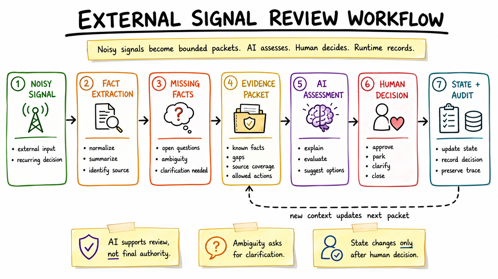

# Workflow Model

This model describes the public-safe shape of the External Signal Review Workflow. The domain terms are generic by design: a signal enters the system, becomes a bounded packet, receives an AI assessment, and changes state only after a human decision.

## End-To-End Flow

## Model Stages

| Stage | Purpose | Output |
|---|---|---|
| Noisy input | Capture an incoming external signal without assuming it is actionable. | Raw source reference and initial signal shell. |
| Fact extraction | Pull out stable known facts from available sources. | Known facts, source references, and confidence notes. |
| Missing facts | Make gaps explicit before recommendation. | Missing fact labels and clarification prompts. |
| Evidence packet | Convert scattered context into a bounded review contract. | Packet with facts, coverage, risks, allowed decisions, and audit fields. |
| AI assessment | Ask AI to reason only over the packet. | Recommendation, confidence, risks, gaps, and next human action. |
| Ranked review queue | Sort items for human attention without pretending rank is final truth. | Review queue with priority and confidence signals. |
| Compact details | Show enough context for fast decision or escalation to dense review. | Item summary, missing facts, assessment, and allowed commands. |
| Human decision | Choose an allowed action or request clarification. | Explicit decision source and selected state transition. |
| Stored state/audit | Persist the result for later review. | Before/after state, packet reference, timestamp category, and decision note. |

## Design Principles

- Evidence comes before AI recommendation.
- Missing facts remain visible rather than hidden in prose.
- Ambiguous items stay in clarification until a human resolves them.
- Dry-run reconciliation plans stay separate from applied actions.
- AI assessment does not mutate state.
- The runtime saves only explicit human-selected transitions.
