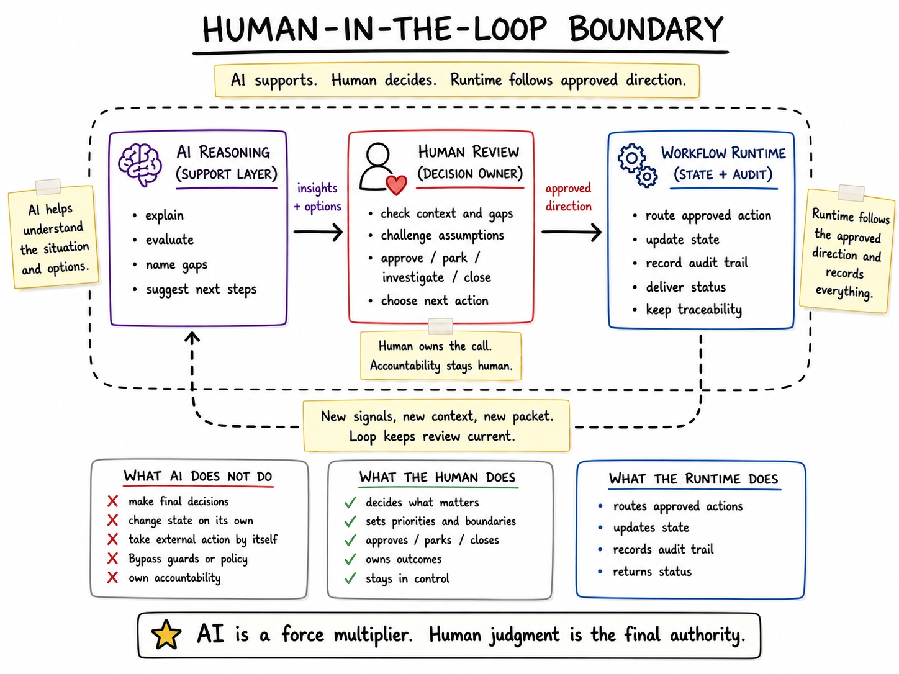

# AI, Runtime, And Human Boundary

The workflow is designed as AI-assisted review, not autonomous action. AI, runtime code, helper tools, and human review each have a different job.

## AI Responsibilities

AI reasons over bounded inputs. It can synthesize evidence, explain likely interpretations, evaluate a packet, name gaps, frame risks, suggest next checks, and produce concise review output.

AI is useful when the packet is narrow. It should explain what the evidence supports, what remains uncertain, and what a human should check next.

## Runtime Responsibilities

The runtime owns workflow mechanics: routing, retrieval, packet generation, state persistence, audit trail, delivery to Telegram and dashboard, and status updates.

The runtime should make the workflow reliable enough to review, but it should not pretend to make judgment calls. A stored state transition is useful only because it records a decision that was made at the boundary.

## Helper Responsibilities

Evidence helpers sit between runtime routing and AI reasoning. They collect source messages, stored state, prior decisions, manual assists, diagnostic signals, and workflow context where those are available for the current workflow.

Their job is not to decide. Their job is to make the packet honest: what was checked, what was missing, what was reconciled, and what should remain uncertain.

Helper and CLI-style tooling can prepare, validate, reconcile, or diagnose evidence. It can show that a packet is thin, that source coverage is partial, or that prior state should be reviewed. It does not own judgment, approve a recommendation, close an item, or convert AI output into an unreviewed state change.

## Human Responsibilities

I remain responsible for goals, judgment, validation, approval, parking, closure, publication decisions, and deciding when more evidence is needed.

This is the acceptance boundary. AI output can inform the decision, but it is not the decision.

## What The System Does Not Claim

The system does not claim autonomous outreach, autonomous mutation, unreviewed action, automatic approval, replacement of human judgment, or measured performance gains without separate validation.

Those exclusions are part of the design. They keep the workflow honest about where AI helps and where authority remains outside the model.

## Why This Boundary Matters

The boundary matters because AI is strongest as a reasoning layer and weakest when it is treated as an unchecked operator.

By separating AI, helper tools, runtime, and human roles, the workflow becomes easier to inspect. If AI overreaches, the packet and allowed actions show the limit. If evidence is missing, the response should name the gap. If state changes, the audit trail should show the human decision. If the workflow needs a new action, that action can be designed explicitly.

The result is not a claim of autonomy. It is a review loop with better structure.
