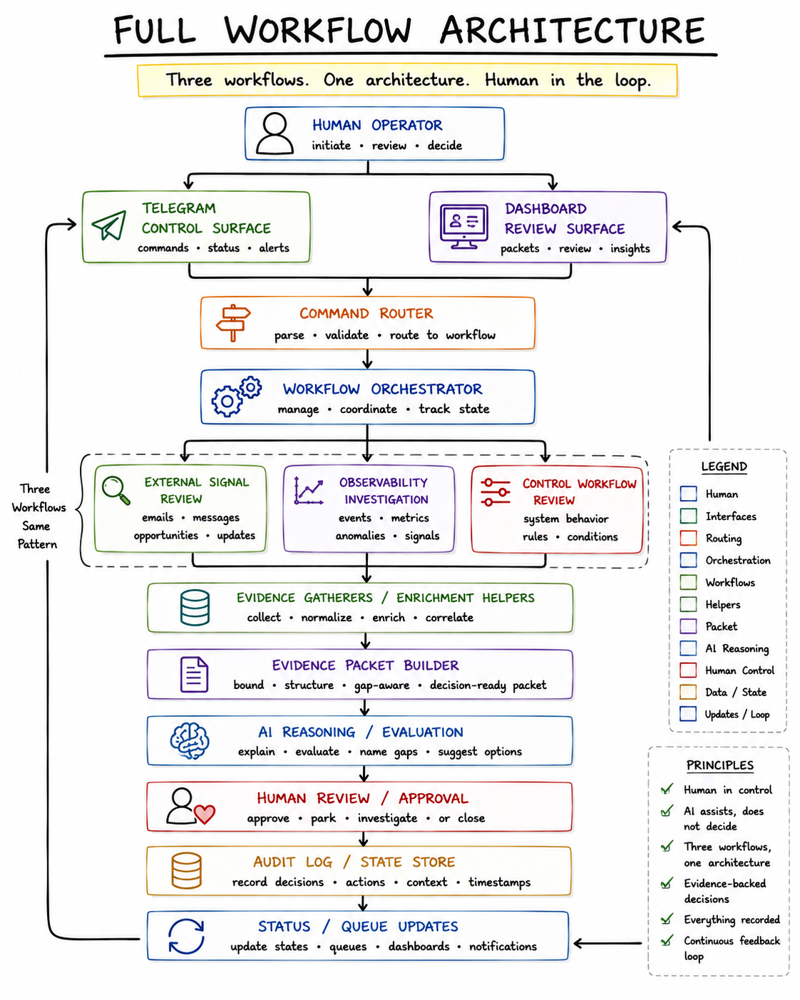
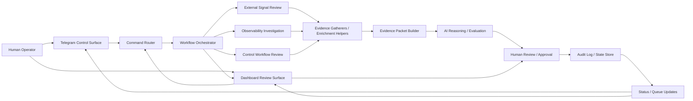
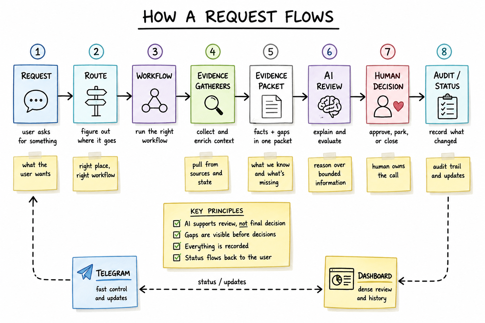
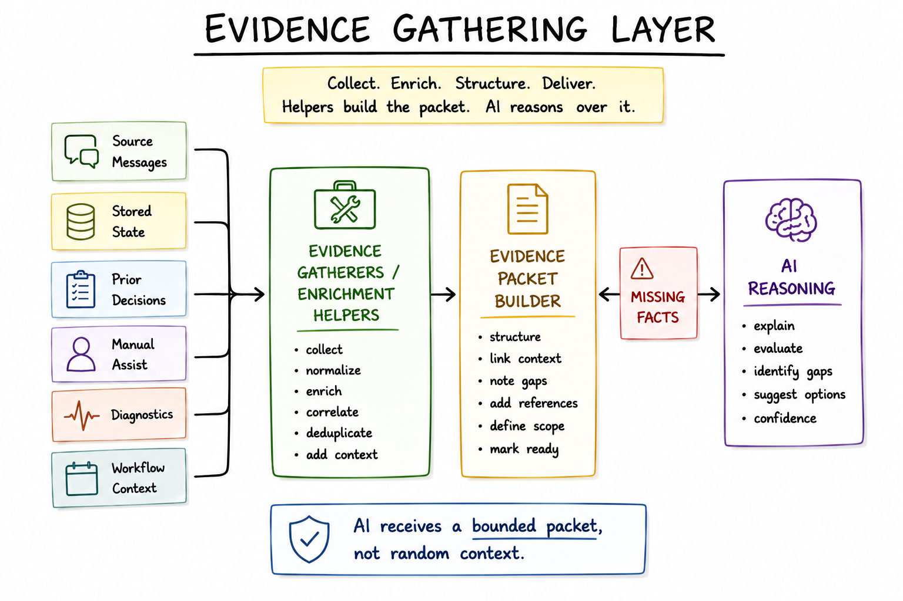
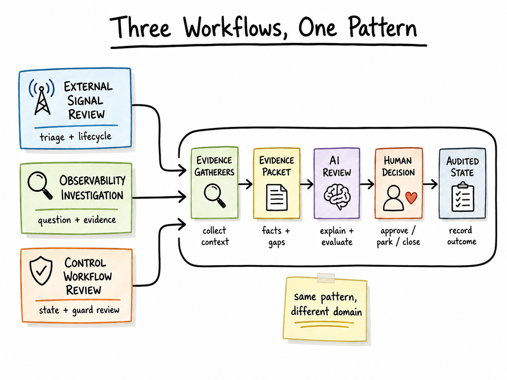

# System And Product Architecture

The architecture is a bounded workflow loop. Telegram and dashboard are entry points. The runtime routes requests and records state. Evidence gatherers collect and reconcile context. A packet builder shapes the AI handoff. AI reasons over the packet. I make the decision.

The technical Mermaid skeleton lives in [assets/architecture.mmd](assets/architecture.mmd). The reader-facing architecture diagram below shows the same structure, and the evidence-gathering diagram later in this page isolates the packet-building layer.

## Architecture In One Pass

I send a command or open the review surface. The router resolves the requested workflow and item scope. The orchestrator calls a bounded module. That module asks helper layers for the evidence that belongs in this request. The packet builder turns the gathered material into a review contract. AI summarizes, evaluates, names gaps, and suggests next checks. I choose the next state. The runtime saves the transition and returns status to Telegram and the dashboard.

The design is intentionally narrow. It does not ask AI to infer everything from a chat history, and it does not let the runtime convert an evaluation into an unreviewed decision.

## Evidence Gathering Layer

The evidence layer sits between workflow intent and AI reasoning. Its job is to make the packet honest.

Supported public-safe categories include source messages, stored item state, prior decisions, source reconciliation, manual or browser-assisted collection, diagnostic helpers, workflow state, and packet construction. Some workflows have implemented prior-state enrichment. Broader local/prior-context search should be described as workflow-specific or planned unless separately validated for the surface being discussed.

**Design decision:** Packet generation is a product stage, not a hidden model trick. The system should expose what was checked, what was not checked, and which gaps remain before AI makes a recommendation.

## Capability And Status Matrix

This matrix is public-safe. It describes current capability without exposing private command names, source names, implementation paths, or raw records.

| Capability | Public-safe status | What it demonstrates |
| --- | --- | --- |
| Telegram command surface | Implemented in underlying workflow-specific surfaces; represented publicly with generic commands. | Fast control for status, one-item lookup, evaluation requests, and explicit lifecycle choices. |
| Dashboard review surface | Implemented for dense workflow-specific review; public draft keeps details generic. | Product judgment around comparison, evidence inspection, lifecycle review, and summary/detail navigation. |
| Evidence packet pattern | Implemented as a recurring workflow pattern and shown through synthetic packet examples. | A clear AI handoff contract with scope, known facts, missing facts, allowed actions, and audit expectations. |
| Source-message intake / reconciliation | Supported in specific workflows; public draft uses generic helper categories. | Intake and state reconciliation before AI evaluation, with ambiguity surfaced instead of hidden. |
| Browser/manual assists | Supported where full automation would be brittle; not presented as universal automation. | Practical automation boundaries and human-controlled enrichment. |
| Prior-state enrichment | Implemented where available and otherwise described as workflow-specific. | Continuity across repeated review loops without relying on model memory. |
| Broader prior-context search | Planned, partial, or workflow-specific unless separately validated. | Claim discipline around current capability versus direction. |
| Maintenance / diagnostic helpers | Supported as helper-layer and maintenance patterns; examples are synthetic. | State inspection, packet health checks, dry-run thinking, and workflow repair without moving judgment into tooling. |
| Visual/synthetic publication layer | Present in this public artifact as public-safe examples and diagram specs. | Communication quality, privacy discipline, and reviewer-friendly artifact design. |

## Design Decisions That Mattered

**Telegram is a control surface, not the whole product.** It makes small actions reachable: status, queue review, item lookup, evaluation request, and explicit decisions. Dense comparison belongs elsewhere.

**The dashboard is a review surface.** It supports comparison, ranking, lifecycle state, evidence inspection, and summary/detail review. It complements chat instead of replacing it.

**Evidence packets are the AI handoff contract.** AI is most useful when it receives a bounded packet with request scope, source coverage, known facts, missing facts, prior state, allowed actions, and review goal.

**The runtime handles mechanics, not judgment.** Routing, evidence retrieval, packet generation, state persistence, audit, and delivery are runtime work. Approving or rejecting a recommendation remains human work.

**Human review is the acceptance boundary.** AI can recommend, explain, and name gaps. I still own the decision to approve, park, close, investigate, or publish.

## What Makes A Workflow Bounded

A workflow is bounded when its inputs, outputs, and allowed decisions are explicit before AI reasoning starts.

For this case study, bounded means the request names a specific item, queue, or investigation scope; the evidence layer gathers only relevant material for that scope; missing facts are listed; AI receives a packet rather than open-ended history; allowed next actions are constrained; and the final state change requires human review.

This keeps the workflow from drifting into broad reconstruction or unsupported action. It also makes the output easier to inspect because the packet, the evaluation, the gaps, and the final decision are separate artifacts.

## Surface Split

Telegram works best for fast control: status, queues, item lookup, evaluation requests, and explicit decisions. It is mobile-readable and action-oriented.

The dashboard works best for dense review: comparison, ranking, lifecycle state, evidence inspection, history availability, and summary/detail navigation.

See [CONTROL_SURFACES.md](CONTROL_SURFACES.md) for the Telegram vs dashboard diagram.

## Evidence Packets

An evidence packet can include request scope, item reference, source coverage, known facts, missing facts, prior state, AI task, allowed actions, and audit policy.

The important behavior is gap visibility. When evidence is incomplete, the AI response should name the missing facts and avoid a stronger conclusion than the packet supports.

See [SYNTHETIC_EXAMPLES.md](SYNTHETIC_EXAMPLES.md) for the evidence packet anatomy diagram and synthetic packet walkthrough.

## Human Review And Audit Loop

The loop is explicit. The runtime presents an item, packet, or explanation. AI may summarize or evaluate the packet. I choose the next action. The runtime saves the state transition. Telegram and the dashboard reflect the updated state.

See [AI_RUNTIME_HUMAN_BOUNDARY.md](AI_RUNTIME_HUMAN_BOUNDARY.md) for the human-in-the-loop boundary diagram.

## Three Workflows, One Pattern

The same architecture supports multiple workflow modules:

- **External Signal Review:** prioritize incoming items, expose missing facts, and support explicit lifecycle decisions.
- **Observability Investigation:** collect relevant evidence for a bounded question, explain likely causes, and name uncertainty.
- **Control Workflow Review:** review generic control state, intent, guard behavior, and next checks while preserving the same decision boundary.

## Next Step

Next step in the core path: [AI_RUNTIME_HUMAN_BOUNDARY.md](AI_RUNTIME_HUMAN_BOUNDARY.md).
