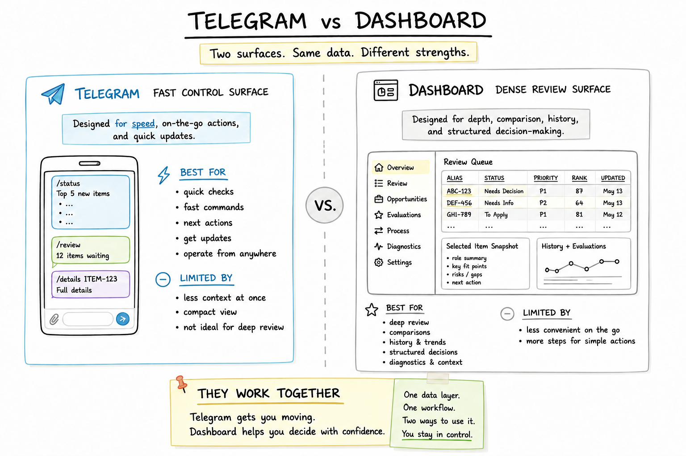

# Control Surfaces

Telegram and the dashboard solve different product problems. Telegram is the fast control surface. The dashboard is the dense review surface.



## Surface Comparison

| Surface | Best for | Input style | Output / review mode | Why it exists |
| --- | --- | --- | --- | --- |
| Telegram | Fast triage, status, one-item lookup, explicit decisions | Short commands | Compact response, next action, confirmation | Reduces friction and makes the workflow reachable from chat/mobile. |
| Dashboard | Dense review, comparison, evidence inspection, lifecycle context | Filters, tables, detail views | Multi-item review, evidence coverage, decision prep | Gives enough room for slower judgment and comparison. |

## Why Chat Was The Right Place To Start

Chat was the right first surface because the early product need was reachability. I wanted a way to ask for status, review a queue, inspect an item, request evaluation, and record a decision without opening a heavier interface.

Telegram also forced each interaction to have a clear command, a narrow scope, and a compact response. That pressure improved the workflow. If a response could not fit into a short, mobile-readable shape, it usually meant the packet was too broad or the review belonged in another surface.

## What Telegram Carries Well

Telegram works for short, action-oriented interactions:

```text
/status
/review
/details ITEM-123
/evaluate ITEM-123
/approve ITEM-123
/park ITEM-123
/close ITEM-123
/investigate
/explain
```

Those commands are useful because they are focused. They do not require a large screen, multi-column comparison, or long context history. They start work, request one packet, or record one human decision.

## Where Chat Breaks Down

Dense review is a different task. Comparing many items, ranking a queue, inspecting source coverage, reviewing lifecycle state, and checking decision history all benefit from layout.

Trying to force that work into chat makes the system harder to use. The output becomes long, important differences are easy to miss, and the user has to keep too much state in memory.

## Why The Dashboard Emerged

The dashboard emerged when review needed space.

I needed to compare items, see which facts were missing, inspect evidence coverage, review lifecycle state, and understand what had already happened. Tables, filters, summary/detail panes, and a denser information hierarchy were the right shape for that work.

The dashboard did not replace Telegram. It took the work that chat was never meant to carry.

**Design decision:** Telegram should stay compact and action-oriented. The dashboard should make evidence and comparison visible before a decision.

## Product Prioritization Decision

The prioritization decision was to keep Telegram narrow and invest heavier review affordances in the dashboard.

That meant chat carried status, one-item lookup, evaluation requests, and explicit lifecycle commands. The dashboard carried comparison, evidence coverage, missing-fact review, history, and decision preparation. This avoided turning Telegram into a dense reporting surface and avoided making the dashboard the only way to move a simple item forward.

The product tradeoff was intentional: optimize the first surface for reachability, then add depth only where the workflow proved that review density mattered.

## What Belongs In The Dashboard

The dashboard is the right surface for comparison, prioritization, lifecycle review, evidence inspection, denser AI evaluation review, missing-fact scans, history availability, and decision preparation.

It should make it easy to see why an item is ready, blocked, parked, or closed. It should help prepare a decision instead of hiding the evidence behind a single generated answer.

## How The Surfaces Work Together

The surfaces share the same backend workflow loop:

```text
Telegram or dashboard
-> router
-> bounded workflow
-> evidence gatherers
-> evidence packet
-> AI reasoning
-> human review
-> state update
```

Telegram is best when I already know the next action or want one compact answer. The dashboard is best when I need to compare, inspect, and prepare. Final decisions remain human-owned in both places.

Supporting tools keep both surfaces from becoming shallow wrappers around AI. They handle intake checks, state reconciliation, packet validation, audit inspection, and diagnostics underneath the visible flow, so Telegram can stay compact and the dashboard can stay focused on review rather than maintenance detail.

## Next Step

Next step in the core path: [SYNTHETIC_EXAMPLES.md](SYNTHETIC_EXAMPLES.md).
