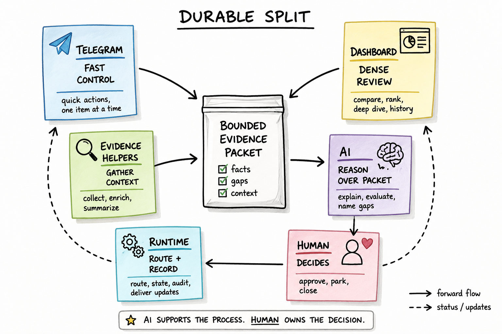

# Telegram-First Control Surface for a Personal AI Workflow Lab

I built this as a practical control layer for personal AI-assisted workflows: fast enough to use from chat, structured enough to gather bounded evidence, and explicit enough that decisions stay mine.

The useful pattern was not "chat runs everything." The useful pattern was a durable split: Telegram for fast control, a dashboard for dense review, helper layers for evidence gathering and enrichment, AI for synthesis over bounded packets, runtime for routing and state, and human review for approval, parking, closure, or follow-up.



## Executive Summary

- **Problem:** Repeated AI-assisted workflow reviews were hard to start, inspect, challenge, and close consistently.
- **Solution:** I designed a Telegram-first control surface backed by dense dashboard review, evidence packets, helper tooling, AI-assisted synthesis, and human-owned decisions.
- **What this demonstrates:** Product judgment around AI workflow boundaries, review-surface design, evidence discipline, and safe public communication of private implementation work.

## What I Was Trying To Solve

I was interested in AI assistants as operating layers for real personal workflows, not only as long chat threads. The question was whether an assistant could help me run work I already cared about while preserving the parts that should not be delegated: goals, judgment, validation, and acceptance.

The early bottleneck was not a lack of information. It was the stitching work around information: current status, prior decisions, available source material, missing facts, likely interpretation, and the next safe action. That work is manageable once. It gets tiring when the same review loop repeats.

The product question became concrete: what is the smallest surface that can start a workflow, gather enough evidence, ask AI for bounded reasoning, and preserve a human decision?

## The First Useful Trigger

The first practical trigger was observability and debugging around a complex automation project. Current state alone was not enough to explain why a workflow behaved a certain way. I needed a bounded question, relevant evidence, uncertainty notes, and a human next check.

That work became the already-published deep dive, **AI-Assisted Debugging Layer for Complex Automation**. In this broader workflow-lab case study, it matters because it supplied the first strong version of the investigation pattern:

```text
ask a narrow question
gather relevant evidence
separate evidence from interpretation
name uncertainty
produce a reviewable explanation
keep AI away from final authority
```

That pattern proved useful outside debugging.

## The Second Recurring Pattern

The next recurring pattern was external signal review: incoming items that needed triage, evaluation, missing-fact checks, and lifecycle decisions.

This workflow felt different from observability. It was less about explaining a past behavior and more about deciding what deserved attention next. Still, the operating shape repeated. A queue needed a fast status view. Each item needed details and source coverage. AI could help summarize fit, gaps, and risks. The decision had to be explicit: approve, park, close, or investigate further. The state transition needed to be visible later.

That was the point where the system stopped feeling like a single bot feature and started feeling like a workflow lab.

## Why Telegram Was The First Front Door

Telegram was the right first surface because it reduced friction. A compact command could ask for status, pull a queue, inspect an item, request an evaluation, or record a decision from the place I already was.

```text
/status
/review
/details ITEM-123
/evaluate ITEM-123
/approve ITEM-123
/park ITEM-123
/close ITEM-123
```

Those commands map well to a phone. They are quick, action-oriented, and easy to fit into a day. They also force clarity. If a response is too long for chat, the workflow probably needs a better packet, a different surface, or a narrower question.

Telegram also kept the first version honest. It was a control surface, not the whole product.

## Quick Example: One Review Loop

A compact version of the pattern looks like this:

```text
User -> /evaluate ITEM-123
Router -> External Signal Review workflow
Evidence layer -> source message, stored state, prior decisions, missing fact flagged
AI -> summarizes fit, gaps, and recommended next check from the bounded packet
Human -> /park ITEM-123 reason:"awaiting missing fact"
Runtime -> state saved, audit note recorded, confirmation returned
```

The important part is not the command syntax. It is the handoff discipline: the AI receives a bounded packet, the missing fact stays visible, and the state change happens only after a human decision.

## Why The Dashboard Became Necessary

Chat is weak for dense review.

As the external signal workflow matured, I needed comparison, ranking, lifecycle context, evidence inspection, missing-fact review, and summary/detail navigation. Telegram can show one item well. It is much weaker when the work is to compare several items or review a longer decision trail.

The dashboard became the second surface because the workflow needed room. It was not a replacement for Telegram. It was the place for slower review: see the queue, compare items, inspect gaps, review evaluation summaries, and prepare a decision with more context on screen.

That became the product lesson: the right surface depends on the review density.

## The Hidden Work: Evidence Gathering

The visible loop is simple: command, packet, AI response, human decision. The hidden work is the evidence layer that makes the packet useful.

The helper layer gathers and reconciles public-safe categories of context:

- source messages and incoming signals
- stored item state
- prior decisions and review history
- source reconciliation and missing-fact checks
- manual or browser-assisted collection when full automation would be brittle
- diagnostic helpers when the normal review view should stay compact
- evidence packet building

This layer is deliberately separate from AI reasoning. Packet generation is not magic, and the AI is not being asked to infer from vague background memory. The runtime and helpers assemble a bounded packet first. AI receives the packet afterward and should stay inside it.

Current helper behavior covers some context collection in the underlying workflows; richer prior-context search remains workflow-specific or planned unless separately validated for a surface.

See [ARCHITECTURE.md](ARCHITECTURE.md#evidence-gathering-layer) for the evidence-gathering layer diagram.
For a concrete synthetic packet shape, see [ARCHITECTURE.md](ARCHITECTURE.md#evidence-packets).

## The Durable Split

The durable workflow pattern is:

```text
control surface
-> router
-> bounded workflow
-> evidence gatherers and enrichment helpers
-> evidence packet
-> AI reasoning
-> human review
-> audited state
```

Each part has a narrow job.

Telegram starts fast interactions. The dashboard supports dense review. The router resolves intent and scope. Workflow modules know their domain boundaries. Evidence helpers collect, reconcile, and expose gaps. The packet builder shapes a review contract. AI synthesizes and explains. I make the decision. The runtime saves the transition.

That separation makes the workflow more reviewable than a loose chat exchange. If an AI response is weak, I can inspect whether the packet was incomplete, whether the task was unclear, or whether the recommendation overreached.

## Three Workflows, One Pattern

The public-safe verticals are:

**External Signal Review:** incoming items move through triage, evaluation, missing-fact review, and explicit lifecycle decisions.

**Observability Investigation:** bounded questions become evidence packets, explanations, uncertainty notes, and human next checks. This is the vertical with an existing public deep dive.

**Control Workflow Review:** generic control state, intent, guard behavior, and next checks can be reviewed without exposing private environment details.

The point is not that all workflows are identical. The point is that they can share a product pattern: bounded evidence, AI-assisted reasoning, human acceptance, and audited state.

## What This Pattern Generalizes To

The pattern generalizes to workflows where the hard part is not one isolated answer, but a repeated review loop with state, evidence, uncertainty, and an explicit decision.

Good candidates have a queue or item, a bounded question, source material that can be checked, a small set of allowed next actions, and a reason to preserve an audit trail. Poor candidates are open-ended tasks where the assistant would need to invent goals, act without review, or treat missing evidence as permission to guess.

The reusable shape is therefore product-level rather than domain-specific: fast control, dense review when needed, packet-backed AI reasoning, visible gaps, human-owned state transitions, and public-safe communication of what the system does and does not claim.

## Where AI Fits

This was not a model-building project. I used existing AI assistants as a reasoning layer, and focused on the workflow around them: evidence gathering, packet design, review surfaces, state, audit, and human decision boundaries.

AI fits where synthesis is valuable and authority is limited.

It can summarize a packet, compare known facts, evaluate a candidate item, explain likely causes, name gaps, suggest next checks, and turn structured evidence into a readable review. It is useful because the packet gives it a narrow job.

AI does not own goals, mutate state without review, approve outcomes, contact anyone, or turn a recommendation into action. Those boundaries are product decisions, not only safety language. The surfaces and runtime are designed to make the boundary visible.

## What This Demonstrates Professionally

This case study demonstrates product and architecture judgment around AI-assisted workflows:

- turning messy personal workflows into bounded review loops
- choosing surfaces based on interaction density and review depth
- designing across Telegram, dashboard, and helper-tool surfaces without forcing one UI to carry every job
- making evidence gathering visible instead of treating packets as automatic
- using AI for synthesis without giving it authority
- designing packet contracts that make reasoning easier to challenge
- setting practical automation boundaries where manual or browser-assisted review is safer than brittle automation
- evolving from one workflow into a reusable workflow pattern
- communicating private systems through synthetic, public-safe artifacts

The current result is a maturing personal workflow lab, not a finished SaaS product. That distinction matters. The value is the pattern, the boundary design, and the disciplined way evidence moves from workflow input to human decision.

## Implementation Evidence

This public export is curated and sanitized, but it is backed by private implementation history. The public artifacts show architecture, synthetic examples, claim notes, and category-level implementation evidence without exposing private data, raw records, or environment-specific code.

For readers who want implementation proof, the sanitized activity ledger provides a public-safe view of implementation themes, iteration patterns, helper categories, and claim-support levels without exposing raw PR history.

See [IMPLEMENTATION_EVIDENCE.md](IMPLEMENTATION_EVIDENCE.md) and [IMPLEMENTATION_ACTIVITY_LEDGER.md](IMPLEMENTATION_ACTIVITY_LEDGER.md) for the public-safe proof layer.

## Recommended Reading Path

- **5-minute review:** Start with this page, then skim the diagrams.
- **Product / PM lens:** Read [CONTROL_SURFACES.md](CONTROL_SURFACES.md) and [WORKFLOW_EVOLUTION.md](WORKFLOW_EVOLUTION.md).
- **Architecture lens:** Read [ARCHITECTURE.md](ARCHITECTURE.md) and [AI_RUNTIME_HUMAN_BOUNDARY.md](AI_RUNTIME_HUMAN_BOUNDARY.md).
- **Proof / credibility lens:** Read [IMPLEMENTATION_EVIDENCE.md](IMPLEMENTATION_EVIDENCE.md) and [IMPLEMENTATION_ACTIVITY_LEDGER.md](IMPLEMENTATION_ACTIVITY_LEDGER.md).
- **Example-first lens:** Start with [SYNTHETIC_EXAMPLES.md](SYNTHETIC_EXAMPLES.md).

## Visual Map

The core diagrams are:

- [Durable split](assets/diagrams/01-durable-split.png): fast control, dense review, evidence, AI reasoning, and human decision.
- [Full workflow architecture](assets/diagrams/07-full-workflow-architecture.png): end-to-end workflow structure.
- [Evidence gathering layer](assets/diagrams/08-evidence-gathering-layer.png): how helper layers prepare bounded packets.
- [Human-in-the-loop boundary](assets/diagrams/06-human-in-the-loop-boundary.png): AI/runtime/human responsibility split.

## What To Read Next

- [PUBLIC_CASE_STUDY.md](PUBLIC_CASE_STUDY.md): companion notes on design tradeoffs and evidence discipline.
- [ARCHITECTURE.md](ARCHITECTURE.md): system and product architecture, including the evidence-gathering layer.
- [CONTROL_SURFACES.md](CONTROL_SURFACES.md): why Telegram and dashboard both exist.
- [SUPPORTING_TOOLS.md](SUPPORTING_TOOLS.md): public-safe helper and maintenance layer behind the visible surfaces.
- [IMPLEMENTATION_EVIDENCE.md](IMPLEMENTATION_EVIDENCE.md): category-level implementation evidence behind the sanitized public export.
- [IMPLEMENTATION_ACTIVITY_LEDGER.md](IMPLEMENTATION_ACTIVITY_LEDGER.md): sanitized activity ledger showing implementation themes, helper categories, and PR type classification.
- [AI_RUNTIME_HUMAN_BOUNDARY.md](AI_RUNTIME_HUMAN_BOUNDARY.md): responsibility model and non-autonomy boundary.
- [WORKFLOW_EVOLUTION.md](WORKFLOW_EVOLUTION.md): how the workflow lab matured.
- [SYNTHETIC_EXAMPLES.md](SYNTHETIC_EXAMPLES.md): public-safe examples built around a coherent `ITEM-123` walkthrough.
- [PUBLIC_ARTIFACT_INDEX.md](PUBLIC_ARTIFACT_INDEX.md): complete artifact map.

## Related Case Studies

- **Published:** AI-Assisted Debugging Layer for Complex Automation.
- **Forthcoming/planned:** External Signal Review.
- **Forthcoming/planned:** Control Workflow Review.
- **Forthcoming/planned:** AI Workflow Operations.

## Next Step

Next step in the core path: [ARCHITECTURE.md](ARCHITECTURE.md).
