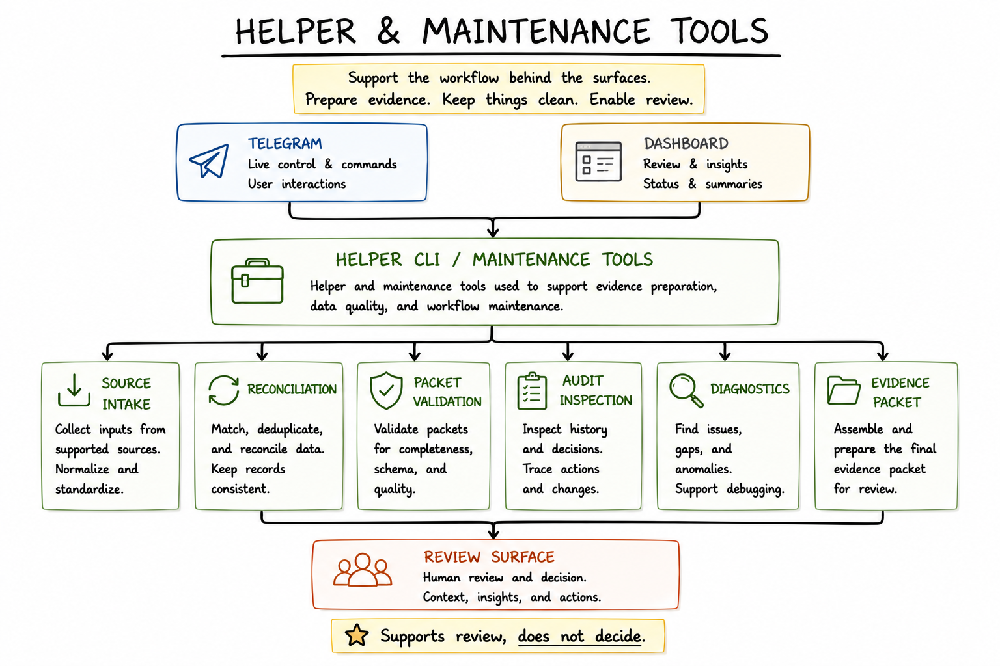

# Supporting Tools

Telegram and the dashboard are the visible product surfaces. Telegram is the fast control surface. The dashboard is the dense review surface.

The supporting tools sit underneath those surfaces. They gather, reconcile, validate, diagnose, and prepare evidence so the visible workflow is not just a thin wrapper around an AI response. Their job is to make review material trustworthy enough to challenge, not to make decisions on their own.

These tools are not the main user experience. They are the maintenance and evidence-quality layer behind the review loop.

## Why This Layer Exists

A compact command like `/review` or `/evaluate ITEM-123` only works if the system can answer a harder question first: what evidence is actually available for this item, which state is current, what changed before, what is missing, and what should stay uncertain?

The helper layer keeps that work explicit. It can inspect state, resolve ambiguity, check packet health, summarize diagnostics, and support maintenance when the normal review surface should stay compact.

This separation is part of the product design:

- Telegram and dashboard carry user-facing review work.
- Supporting tools prepare and inspect the material behind that review.
- AI reasons over bounded packets after evidence is assembled.
- The human still owns approval, parking, closure, follow-up, and publication decisions.

## Public-Safe Helper Categories

The public-safe helper categories are intentionally generic:

| Helper category | Public-safe role |
| --- | --- |
| Source-message intake | Bring incoming messages or signals into a reviewable queue. |
| Source reconciliation | Match new source material against stored item state and reduce duplicate or conflicting records. |
| Stored item state | Inspect the current lifecycle state, known facts, and prior review markers for an item. |
| Prior decisions / review history | Surface earlier human decisions or review notes where available. |
| Missing-fact checks | Identify gaps that should limit the strength of an AI recommendation. |
| Manual/browser-assisted enrichment | Support review when full automation would be brittle or unsafe. |
| Packet validation | Check whether a packet has enough scope, source coverage, known facts, missing facts, allowed actions, and audit policy for review. |
| Audit/state inspection | Show what changed and why without exposing raw private records. |
| Diagnostic summaries | Explain workflow health, import status, duplicate risk, or evidence coverage in compact maintenance language. |
| Workflow maintenance helpers | Support repair, cleanup, dry-run checks, and bounded operational inspection. |
| Evidence-pack preparation | Prepare public-safe or review-safe evidence bundles when the workflow needs a documented handoff. |

Some categories are implemented in specific underlying workflows. Some are workflow-specific, partial, or directional. The public case study should preserve that distinction instead of implying a universal helper layer.

For the public-safe proof layer behind these category claims, see [IMPLEMENTATION_EVIDENCE.md](IMPLEMENTATION_EVIDENCE.md) and the detailed sanitized activity mapping in [IMPLEMENTATION_ACTIVITY_LEDGER.md](IMPLEMENTATION_ACTIVITY_LEDGER.md).

## How Helpers Improve AI Review

AI review is only as useful as the packet it receives. Helper tools improve the packet before the model sees it:

- They make source coverage visible.
- They separate known facts from missing facts.
- They keep prior state and review history from being lost.
- They expose ambiguity instead of hiding it in a generated answer.
- They support dry-run and validation steps before mutation.
- They keep diagnostics out of the primary UI unless they help the current decision.

The important boundary is authority. A helper can prepare, validate, reconcile, or diagnose evidence. It should not approve an item, invent missing facts, or turn an AI recommendation into an unreviewed state change.

## Synthetic CLI Shapes

These are synthetic command shapes that demonstrate the helper-layer pattern. They are not copied from private tooling.

The examples below use `ITEM-123` to match the synthetic walkthrough in [synthetic-examples/](synthetic-examples/).

| Synthetic command shape | Helper problem it solves | Workflow fit | State behavior | Reviewability benefit |
| --- | --- | --- | --- | --- |
| `workflow scan --source messages --dry-run` | Checks what source messages or signals would enter the queue without committing them. | Runs before intake or during maintenance. | Read-only in this synthetic example. | Shows source coverage and import candidates before the review queue changes. |
| `workflow reconcile ITEM-123 --explain` | Compares incoming source material against stored item state and explains conflicts or duplicate risk. | Runs when item state is ambiguous or source material changed. | May propose changes, but the synthetic example treats it as explain-only until approved elsewhere. | Makes reconciliation assumptions visible before a packet or decision is trusted. |
| `workflow packet ITEM-123 --validate` | Checks whether the packet has the minimum review contract: scope, known facts, missing facts, source coverage, AI task, allowed actions, and audit policy. | Runs before `/evaluate ITEM-123` or dashboard evaluation review. | Read-only in this synthetic example. | Prevents a thin packet from becoming an overconfident AI answer. |
| `workflow audit ITEM-123 --summary` | Summarizes prior state transitions, review notes, and decision history in public-safe terms. | Runs during item detail review or maintenance. | Read-only in this synthetic example. | Helps the reviewer understand what already happened without inspecting raw records. |
| `workflow diagnose --scope review-window` | Summarizes workflow health, evidence coverage, and likely blockers for the current review window. | Runs when the queue looks inconsistent, stale, or under-explained. | Read-only in this synthetic example. | Separates workflow health from item judgment and points to missing evidence. |

## What These Tools Are Not

The helper layer is not an autonomous agent, a hidden decision maker, or a private command reference. The public examples avoid real command names, source names, paths, logs, records, and operational identifiers.

The public lesson is the pattern: reliable AI-assisted review needs supporting tools that prepare evidence and reveal uncertainty before a human makes a decision.
