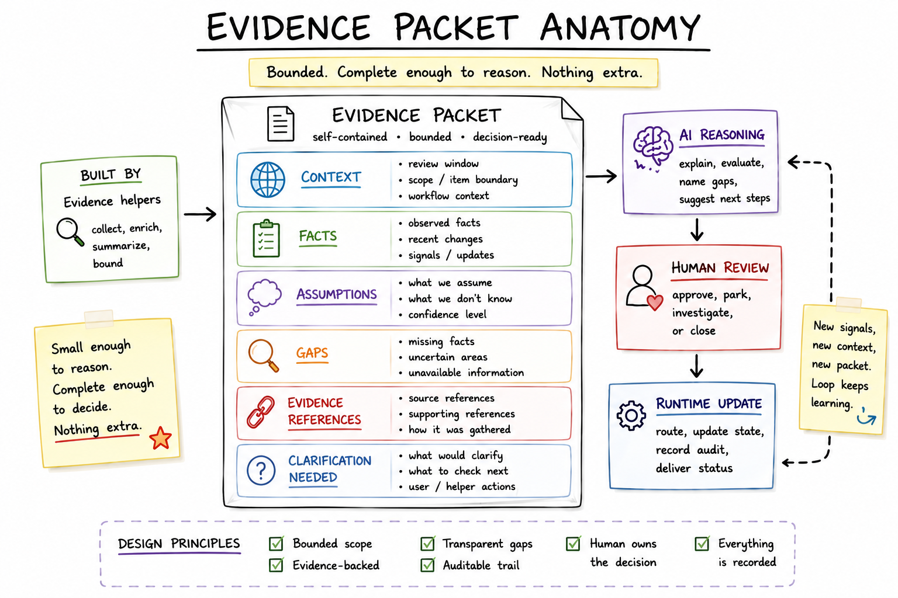

# Synthetic Examples

The detailed examples now live in [synthetic-examples/](synthetic-examples/).

These are synthetic or public-safe composite examples. They preserve workflow shape, command style, evidence categories, and review boundaries without exposing private data or operational records.

The first five examples share one coherent `ITEM-123` walkthrough. Read them in order to see the same item move from fast command control, to dense dashboard review, to helper-layer validation, to packet-backed AI evaluation, to a human lifecycle decision.

For the helper and maintenance layer behind these examples, see [SUPPORTING_TOOLS.md](SUPPORTING_TOOLS.md).

## Start With This Walkthrough

For the most coherent read, follow the same synthetic `ITEM-123` through:

1. [Telegram command flow](synthetic-examples/telegram-command-flow.md) — fast control and request entry.
2. [Dashboard review flow](synthetic-examples/dashboard-review-flow.md) — dense review and comparison.
3. [Evidence packet shape](synthetic-examples/evidence-packet-shape.json) — bounded AI handoff contract.
4. [External signal review](synthetic-examples/external-signal-review.md) — lifecycle decision and audit note.

## Example Index

- [Telegram command flow](synthetic-examples/telegram-command-flow.md): compact mobile-readable control for `ITEM-123`.
- [Dashboard review flow](synthetic-examples/dashboard-review-flow.md): dense comparison and evidence review for the same item.
- [Helper CLI flow](synthetic-examples/helper-cli-flow.md): synthetic dry-run scan, reconciliation, packet validation, audit summary, and diagnostic checks for `ITEM-123`.
- [Evidence packet shape](synthetic-examples/evidence-packet-shape.json): synthetic JSON packet used by the walkthrough.
- [External signal review](synthetic-examples/external-signal-review.md): lifecycle decision flow using `/review`, `/details ITEM-123`, `/evaluate ITEM-123`, and explicit human decisions.
- [Observability investigation](synthetic-examples/observability-investigation.md): bounded investigation with evidence, hypothesis, uncertainty, and next check.
- [Control workflow review](synthetic-examples/control-workflow-review.md): generic state, intent, guard, AI explanation, and human approval boundary.
