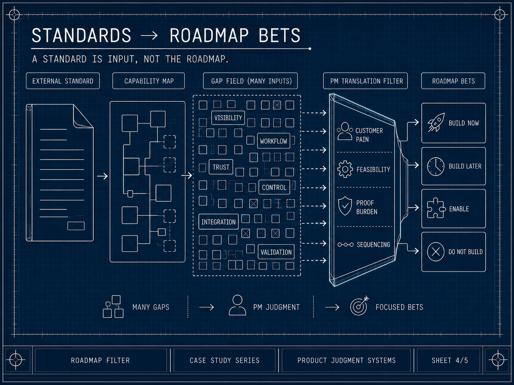

# Artifact Gallery

These accepted diagram sheets support the case study at the pattern level. They use public-safe abstractions rather than source materials, private prompts, screenshots, or company-specific recommendations.

## FARO Orientation

*FARO shows how incomplete information can still support safe product action when coverage and confidence are made explicit.*

## Evidence Routing

*Evidence states route to different product actions; observed, inferred, missing, conflicting, and stale evidence should not carry the same confidence.*

## Operating Model

*The PM workflow remains the primary path. AI supports research, framing, critique, and rehearsal, while judgment gates stay PM-owned.*

## Roadmap Filter

*A standard is input, not the roadmap. The PM translation filter turns many possible gaps into focused roadmap bets, including the choice not to build.*

## Responsibility Boundary

*AI can assist the work, but the PM judgment gate controls what becomes defensible output.*

[Back to case study README](README.md) · [Back to repository index](../../README.md)
