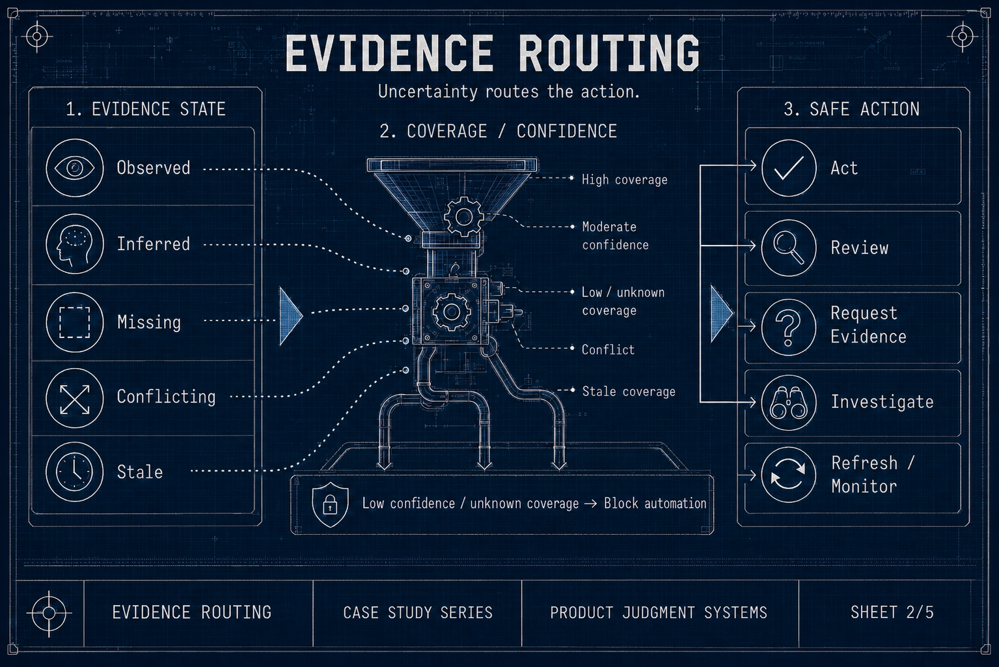

# Process

**Artifact type:** Portfolio Practice Case Study

## Operating Model

I use this workflow for AI-era interview assignments where I need to learn quickly, produce a credible artifact, and defend the reasoning live. The core rule is simple: AI can accelerate research, synthesis, critique, mock discovery, and rehearsal, but the product thesis, prioritization, tradeoffs, non-goals, recommendation, and live-defense rationale remain mine.

The workflow is not a prompt recipe. It is a judgment system for making the reasoning inspectable under ambiguity.

*The PM workflow remains the primary path. AI supports research, framing, critique, and rehearsal, while judgment gates stay PM-owned.*

## Timebox Reality Check

Many home assignments include a recommended time investment. I treat that as a constraint, not as proof that the work is simple. A defensible senior PM answer often requires domain ramp, source review, problem framing, prioritization, artifact design, and presentation prep.

AI can compress that work by helping me navigate unfamiliar material, compare framings, and rehearse challenges. Compression is not delegation. If I cannot defend the recommendation without the model present, the process failed.

## Intake

The first pass is not about writing. I clarify what is being asked, what is ambiguous, and what kind of judgment the assignment is likely testing.

The intake output is a small working brief:

- what must be answered;
- who the answer is for;
- which constraints are explicit;
- which assumptions are necessary;
- what evidence would materially change the recommendation;
- what the live discussion is likely to probe.

## Domain Map

I build a fast map of terms, actors, workflows, constraints, and failure modes. In familiar domains, this keeps me from over-relying on muscle memory. In less familiar security or infrastructure domains, it helps me ramp without pretending to be a domain-native expert.

Useful ramp outputs include:

- a glossary of primitives and relationships;
- source-backed facts versus unresolved assumptions;
- buyer, user, operator, and technical-reviewer concerns;
- traps such as feature-list thinking, unsupported technical claims, or treating a standard as the roadmap.

## Mock Discovery

I use AI to role-play stakeholders and reviewers, then I apply my own discovery skills. The point is not to accept simulated answers as fact. The point is to practice asking sharper questions, listen for contradictions, and separate user pain from solution language before I commit to a thesis.

Useful roles include skeptical customer, analyst, security reviewer, platform owner, data owner, operator, executive stakeholder, and the person in the live discussion who will ask why the recommendation is wrong.

## Source Hierarchy

I decide which sources are credible, which are directional, and which should not drive the recommendation.

My rough hierarchy is:

- assignment materials and stated constraints;
- primary technical references, standards, docs, or public product material;
- credible market, buyer, and user context;
- AI synthesis as navigation and critique;
- my own assumptions, explicitly labeled.

AI can help organize and interrogate sources, but it does not convert weak evidence into strong evidence. When a claim depends mostly on synthesis or inference, I downgrade it into an assumption, validation question, risk, or reason to narrow the MVP.

*Evidence states route to different product actions; observed, inferred, missing, conflicting, and stale evidence should not carry the same confidence.*

## Product Thesis

The product thesis answers: what customer problem matters most, why now, what should be built first, what should wait, and what evidence supports that choice?

I expect the first version to be incomplete. The workflow is designed to expose weak assumptions early. AI can suggest framings and contradictions, but I decide which customer problem is central, which tradeoff is acceptable, and which recommendation I am prepared to defend.

## Scope And Non-Goals

I force the answer into three buckets:

- **MVP:** the smallest coherent product move that creates customer value and teaches the team something important.
- **Later:** valuable capabilities that depend on adoption, evidence, technical readiness, or sequencing.
- **Non-goals:** tempting features or claims that would dilute focus, create false confidence, or exceed what the evidence supports.

This prevents a standards checklist, brainstorm, or AI-shaped feature list from masquerading as a roadmap.

## Critique Loop

The critique loop asks:

- What claim is unsupported?
- What would a technical reviewer challenge?
- What would a hiring manager worry is too junior?
- What would an executive find unclear?
- What alternative strategy is stronger?
- What assumption would change the recommendation?
- What should be removed because it creates risk without adding value?

The loop ends only when the artifact can answer four questions cleanly:

- What is the product thesis?
- What evidence supports it, and what evidence is thin?
- Why is the MVP the right first move?
- What would change the recommendation?

## Artifact Construction

I build the deliverable around the judgment path, not around a generic template. The artifact should make the reasoning easy to inspect: problem frame, source discipline, thesis, tradeoffs, MVP, non-goals, and live-defense hooks.

The artifact is not a research dump or an AI-generated slide marathon. It is a compact representation of the product judgment I am prepared to defend.

## Live-Defense Prep

I prepare for the conversation after the deck:

- the opening product thesis;
- why the MVP is the right first move;
- what I deliberately did not build;
- what evidence is strong or weak;
- where the recommendation would change;
- how I would answer technical, customer, business, and execution challenges.

The aim is not to memorize lines. The aim is to reason clearly in front of evaluators.

I sometimes turn the material back into a simulated discussion or audio-style walkthrough so I can hear where the reasoning is thin, where the story jumps too quickly, and where I need to be clearer about evidence or uncertainty. I treat that as rehearsal and critique, not answer generation.

## Retrospective Capture

After the assignment, I capture what worked, what broke, what questions came up, where the artifact underexplained the reasoning, and how the process should change next time.

This turns each assignment into a reusable learning system without publishing private prompts, decks, transcripts, or company-specific recommendations.

[Back to case study README](README.md) · [Back to repository index](../../README.md)
