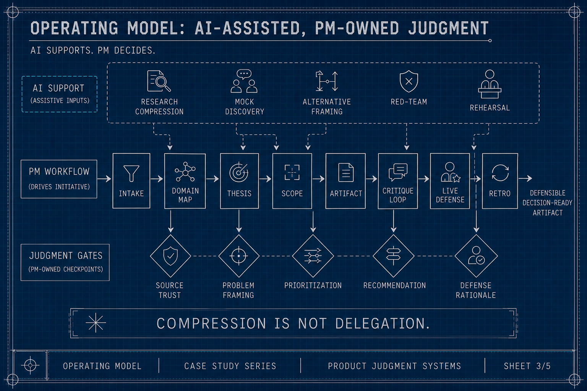
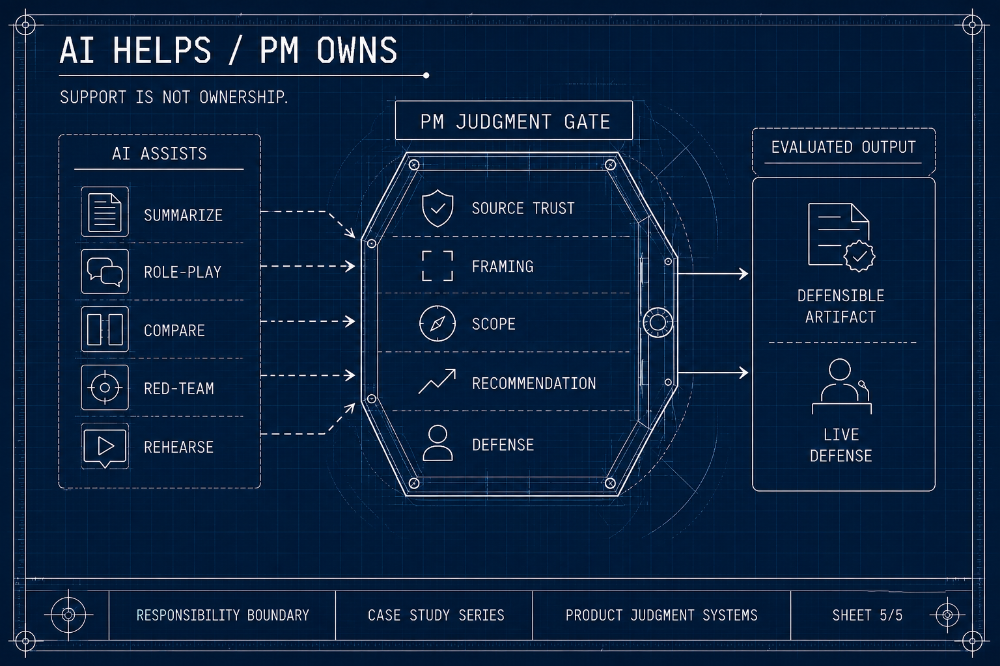
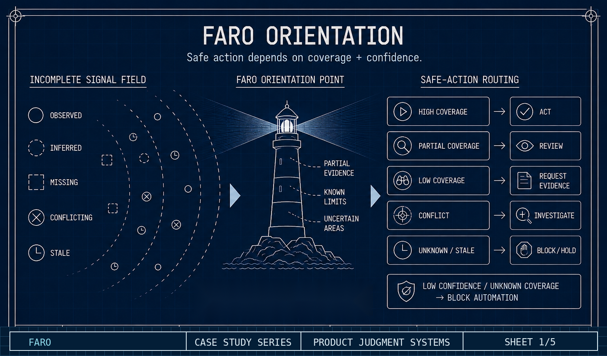

# Using AI Without Outsourcing Product Judgment

*A senior PM workflow for AI-era interview assignments: learning fast, producing a defensible artifact, and owning the live discussion.*

**Artifact type:** Portfolio Practice Case Study

## Read the supporting pages

- [Process](PROCESS.md) — the repeatable PM operating model.
- [Examples](EXAMPLES.md) — sanitized product-judgment examples.
- [Artifact Gallery](ARTIFACT_GALLERY.md) — the five accepted visual sheets.
- [Back to repository index](../../README.md)

## Reviewer takeaways

- I use AI as a research, critique, and rehearsal accelerator.
- I do not use it to make the product judgment call.
- The artifact is designed to show framing, prioritization, tradeoffs, evidence discipline, and live-defense readiness.

## Who this is for

This is written for product leaders, hiring managers, and interviewers evaluating senior PM judgment in AI-era take-home assignments. It is also a public-safe portfolio artifact showing how I use AI as leverage without outsourcing the reasoning being evaluated.

## 1. The real test is not the deck

Generative AI changed interview assignments. A polished deck is no longer a strong enough signal by itself. It is easier than ever to produce something that looks structured, confident, and complete. The harder question is whether I understood the problem, made the judgment calls myself, and can defend the reasoning when a hiring team probes the details.

This practice case study describes the workflow I use for senior PM interview assignments. I use AI heavily, but not as the author of the answer. AI helps me compress research, simulate discovery, compare framings, pressure-test assumptions, and prepare for live discussion. I still own source interpretation, product thesis, prioritization, scope, recommendation, and the rationale I would need to defend in the room.

The process works whether the domain is familiar or unfamiliar. In a familiar fintech assignment, the same structure prevents me from over-relying on muscle memory. In a less familiar security or infrastructure assignment, it helps me ramp quickly without pretending to be a domain-native expert. In both cases, the goal is the same: make the thinking explicit enough that I can defend it live.

The practical goal is not to create a perfect-looking artifact. It is to increase the likelihood that the assignment becomes a serious live discussion, and that I can handle that discussion with evidence, humility, and clear product judgment.

## 2. Why this matters now

The public debate around AI and take-home assignments is not settled. Some employers restrict AI because they want to isolate individual reasoning. Others allow or even expect it because AI is now part of modern product work. Both positions are understandable.

The more useful question is not only whether AI was used. It is what AI was used for, what the candidate verified, where the candidate overrode the model, and which judgment calls they can defend live.

There is also a practical timebox issue. Many home assignments include a recommended time investment. That estimate can be reasonable for producing a surface-level answer, but it is often tight when the real work includes domain ramp, source review, problem framing, prioritization, artifact design, and presentation prep. AI legitimately changes that equation by compressing research, synthesis, critique, and rehearsal. But compression is not delegation. The final judgment still has to be mine.

For senior PM roles, AI usage itself is becoming a relevant signal. A strong evaluation should not simply ask, "Did the candidate use AI?" It should ask whether the candidate used AI in a way that shows product judgment, source discipline, critique-seeking, and ownership.

## 3. The operating model

The depth of each step changes by domain; the sequence remains useful.

1. **Intake** - Clarify what is being asked, what is ambiguous, and what kind of judgment the assignment is likely testing.
2. **Timebox reality check** - Separate what the assignment nominally asks for from the work actually required to produce something defensible.
3. **Domain map** - Build a fast map of terms, actors, workflows, constraints, and failure modes.
4. **Mock discovery** - Use AI to role-play relevant stakeholders, then apply my own discovery skills: ask sharper questions, listen for contradictions, and separate user pain from solution language.
5. **Source hierarchy** - Decide which sources are credible, which are directional, and which should not drive the recommendation.
6. **Product thesis** - Commit to a clear interpretation of the problem rather than presenting every possible angle.
7. **Scope and non-goals** - Define what belongs in the proposed solution, what comes later, and what should be explicitly excluded.
8. **Artifact construction** - Build the deliverable around the judgment path, not around a generic template.
9. **Critique loop** - Use AI and my own review pass to attack weak assumptions, missing personas, unsupported claims, and awkward live-defense moments.
10. **Live-defense prep** - Prepare for the conversation after the deck: what I would defend, where I would concede uncertainty, and how I would respond to better information.
11. **Retrospective capture** - Preserve what I learned, what I rejected, and what I would change if new evidence appeared.



*The PM workflow remains the primary path. AI supports research, framing, critique, and rehearsal, while judgment gates stay PM-owned.*

For the full workflow, see [Process](PROCESS.md).

## 4. What AI does, and what I own

The cleanest boundary I have found is this: AI can help me learn faster and challenge harder; it should not make the judgment call that the interview is evaluating.

In practice, I use AI in five ways:

- **Research compression:** summarizing terminology, market structure, product patterns, and technical concepts so I could ask better questions faster.
- **Mock discovery:** playing the role of a skeptical customer, analyst, security reviewer, platform owner, data owner, operator, or executive stakeholder. This let me practice leading discovery rather than merely reading background material.
- **Alternative framing:** surfacing competing interpretations so I can pressure-test my own framing before committing to it.
- **Critique and red-team review:** attacking weak assumptions, unclear personas, unsupported claims, and uncomfortable live questions.
- **Presentation preparation:** simulating Q&A and helping me rehearse how I would explain tradeoffs, non-goals, and evidence boundaries.

I sometimes turn the material back into a simulated discussion or audio-style walkthrough so I can hear where the reasoning is thin, where the story jumps too quickly, and where I need to be clearer about evidence or uncertainty. That is rehearsal and critique, not answer generation.

The ownership line matters. I own the source-trust decisions, the interpretation, the product thesis, the prioritization, the MVP and non-goals, the final recommendation, and the reasoning I would have to defend without the model present.

| AI helps with | I own |
|---|---|
| Research compression | Source trust |
| Mock discovery | Product thesis |
| Alternative framing | Prioritization |
| Critique and red-team review | MVP and non-goals |
| Presentation rehearsal | Live-defense rationale |



*AI can assist the work, but the PM judgment gate controls what becomes defensible output.*

For the complete visual series, see [Artifact Gallery](ARTIFACT_GALLERY.md).

Both examples are public-safe reconstructions at the pattern level; they do not disclose original prompts, submitted materials, or company-specific recommendations. For the expanded examples, see [Examples](EXAMPLES.md).

## 5. Example A - FARO: progressive value under incomplete coverage

The first example pattern comes from a data-security style problem. The system is trying to surface risk before it has full coverage of the environment. The obvious pressure is speed: how quickly can it scan, classify, and show useful results? But the deeper product problem is trust. If the system only sees part of the picture, what can it responsibly tell the user? What actions are safe? What must be labeled as incomplete?

The product concept I used was **FARO - First-wave Assisted Risk Orientation**.

The name gave me a useful presentation hook: **Fårö Lighthouse** is a real lighthouse on the island of Fårö near Gotland. The story worked because a lighthouse does not remove fog, guarantee safe passage, or replace the navigator. It gives people a fixed point of orientation when visibility is limited.

That was the product metaphor: do not pretend the first wave of coverage is complete; help the user orient under uncertainty.



*FARO shows how incomplete information can still support safe product action when coverage and confidence are made explicit.*

The reframe was:

- **Not:** How do we show a complete report faster?
- **Instead:** How do we create useful, confidence-labeled orientation before coverage is complete?

The product work was about controlling the promise. A weaker answer would make the early result sound complete. A stronger answer makes incompleteness visible and still creates value through orientation, prioritization, and safe next actions.

This example forced several concrete PM decisions:

- What counts as a confirmed signal versus a likely signal?
- How should the product label coverage gaps without making the experience feel broken?
- Which actions are safe when coverage is partial?
- Which recommendations should be blocked until there is stronger evidence?
- How should the user move from first-wave orientation to deeper investigation?

The value was not pretending to know everything. The value was helping the user make a better next decision despite incomplete coverage.

## 6. Example B - standards-to-roadmap mapping

The second example pattern comes from a technical platform assignment. The input is a standard, framework, or capability expectation. The tempting move is to treat the standard as a backlog: find gaps, list features, and call it a roadmap.

That is not product judgment. A standard describes a world of possible requirements. A roadmap chooses which product bets are worth making for specific customers, constraints, and sequencing logic.

The reframe was:

- **Not:** Which standard gaps exist?
- **Instead:** Which gaps represent valuable, feasible, and defensible product opportunities, and in what order should they be pursued?

This is where AI is useful but dangerous. It can help summarize the standard, extract capability language, and suggest gap taxonomies. But it can also make every gap sound equally important. The PM work is to decide which gaps should become product bets, which should become evidence or export improvements, which should remain later, and which should be ignored.

This example forced a different set of decisions:

- Which capabilities are table stakes versus differentiators?
- Which gaps create user value, and which only create checklist completeness?
- Which work improves customer trust through better evidence, reporting, or attestation?
- Which opportunities are feasible within the likely engineering and UX constraints?
- Which sequence creates a coherent roadmap instead of a feature pile?

The public pattern I want to show is simple:

```text
external standard
-> capability map
-> gap classes
-> opportunity classes
-> prioritization logic
```

The private assignment details are not needed for this practice case study to demonstrate the judgment.

## 7. What I would want a reviewer to take away

I would not want this work judged by whether AI made the final artifact look cleaner. Polished is cheap now. I would want it judged by whether the reasoning is defensible: how I framed the problem, what assumptions I controlled, what I chose not to solve, how I used critique, and whether I could explain the recommendation live.

That is why I do not think AI makes senior PM assignments obsolete. It changes what they should test. A good assignment should now test both product judgment and AI leverage: can the candidate use AI to learn faster, think harder, and produce a clearer artifact while still owning the answer?

That is the standard I am trying to hold myself to.
